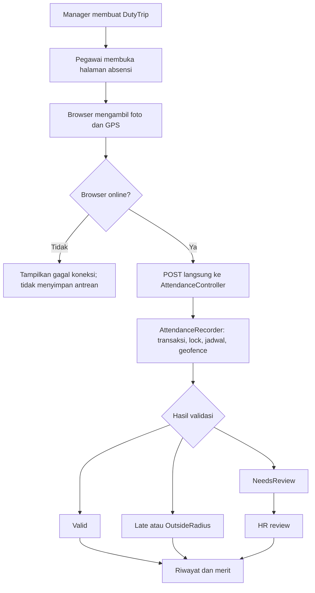

# Baseline Perubahan Service Absensi Dinas

Tanggal: 2026-07-28  
Status: implementasi selesai; verifikasi MySQL development pending  
Asumsi: project akhir mata kuliah, database development boleh dihapus dan dibuat ulang.

## Tujuan

Menyisakan workflow absensi dinas yang cukup membuktikan proses bisnis tanpa biometrik, dukungan offline, PWA, reminder otomatis, dan retensi foto otomatis.

Baseline ini menggantikan rekomendasi audit awal. Perubahan nanti harus mengacu ke batas, target workflow, daftar file, dan kriteria selesai dalam dokumen ini.

## Keputusan Scope

### Dipertahankan

- Manager membuat dan mengelola `DutyTrip`.
- Pegawai mengambil foto dan koordinat GPS.
- Browser mengirim absensi langsung ke server saat online.
- Server memvalidasi pegawai, status dinas, jadwal, koordinat, akurasi GPS, radius, dan satu absensi per hari.
- Foto disimpan pada private storage dan hanya diakses melalui route terotorisasi.
- Status `Valid`, `Late`, `OutsideRadius`, dan `NeedsReview`.
- HR memonitor dan memverifikasi absensi bermasalah.
- Activity log, riwayat, dashboard inti, laporan, dan perhitungan merit.
- Notifikasi `AttendanceNeedsReview` berbasis database bila masih dibutuhkan HR.

### Dihapus

- Face verification, face descriptor, model wajah, dan Python extractor.
- Offline queue, IndexedDB, Background Sync, dan status sinkronisasi.
- PWA, service worker, manifest, installability, cache offline, dan web push.
- Reminder absensi terjadwal.
- Command dan schedule retensi foto otomatis.

### Tidak Dikerjakan pada Tahap Ini

Temuan audit lain tetap valid, tetapi bukan bagian baseline penghapusan pertama:

- penyederhanaan state `DutyTrip`;
- penghapusan `HrAttendanceDropAlert`;
- penggabungan aksi verifikasi HR yang duplikat;
- penghapusan `mock_location_suspected`;
- penghapusan scaffold `getRelations()` kosong.

Pemisahan ini mencegah refactor melebar. Kerjakan setelah baseline lolos test.

## Target Workflow

Tidak ada jalur sinkronisasi kedua. Satu jalur tulis: halaman capture, HTTP POST, controller, recorder, database.

## Komponen Inti yang Dipertahankan

- [`AttendanceController`](/root/perkuliahan/abl-v2/app/Http/Controllers/AttendanceController.php): authorization, HTTP validation, penyimpanan dan cleanup foto, private photo response.
- [`AttendanceRecorder`](/root/perkuliahan/abl-v2/app/Services/AttendanceRecorder.php): transaksi, row lock, aturan domain, geofence, status, activity log.
- [`GeoDistance`](/root/perkuliahan/abl-v2/app/Support/GeoDistance.php): hitung jarak tanpa dependency.
- [`Attendance`](/root/perkuliahan/abl-v2/app/Models/Attendance.php): relasi, cast, dan verifikasi HR.
- [`capture.blade.php`](/root/perkuliahan/abl-v2/resources/views/attendance/capture.blade.php): UI, kamera, GPS, watermark, satu HTTP request.
- Filament Attendance resource: monitoring, detail, private photo, dan review HR.
- Unique constraint `duty_trip_id`, `employee_id`, `attendance_date`: pencegah duplikasi tanpa `client_uuid`.

## Workstream Wajib

### 1. Hapus Face Verification

Hapus:

- `app/Http/Controllers/FaceVerificationController.php`
- `resources/python/face_extract.py`
- `public/js/face-api.js`
- `public/js/face-verification.js`
- seluruh `public/models`
- route face verification pada [`web.php`](/root/perkuliahan/abl-v2/routes/web.php)
- dependency `@vladmandic/face-api` dari `package.json` dan lockfile
- migration penambah `face_descriptor` dan `face_descriptor_path`
- penyimpanan file `face-descriptors/*`

Ubah:

- halaman capture: hapus pemuatan model, ekstraksi descriptor, perbandingan wajah, dan payload `face_descriptor`;
- controller: hapus pencarian descriptor sebelumnya dan validasi `face_descriptor`;
- recorder: hapus validasi, penyimpanan, pembacaan, dan perbandingan descriptor;
- model, seeder, Filament, dan test: hapus field serta assertion biometrik.

Hasil: foto tetap bukti visual; HR melakukan review manual.

### 2. Hapus Offline Queue

Hapus dari halaman capture:

- database IndexedDB dan object store antrean;
- `openQueue`, `queueAttendance`, `syncQueue`, dan listener `online`;
- registrasi `sync-attendance`;
- payload `client_uuid`;
- pesan sukses semu seperti “tersimpan untuk disinkronkan”.

Hapus dari server:

- validasi dan lookup `client_uuid`;
- kolom serta unique index `client_uuid`;
- kolom `synced_at`;
- `AttendanceStatus::PendingSync`;
- UI, cast, seeder, dan test terkait sinkronisasi.

Perilaku pengganti:

- submit hanya lewat HTTP langsung;
- kegagalan jaringan menampilkan error dan membiarkan pengguna mencoba ulang;
- duplikasi dicegah unique constraint harian dan pengecekan recorder.

Tidak menyimpan foto absensi pada browser.

### 3. Hapus PWA dan Web Push

PWA sebelumnya global karena service worker didaftarkan pada tiga panel. Penghapusan `public/sw.js` membutuhkan cleanup project-wide, bukan hanya halaman absensi.

Hapus:

- `public/sw.js`
- `public/manifest.json`
- icon khusus PWA di `public/icons`
- `resources/views/pwa/register.blade.php`
- render hook PWA dari Employee, Manager, dan HR panel provider
- `WebPushController` beserta route subscribe/unsubscribe
- `config/webpush.php`
- migration `push_subscriptions`
- trait/subscription plumbing web push pada `User`
- dependency `laravel-notification-channels/webpush` dari Composer dan lockfile
- import, channel `webpush`, dan method `toWebPush()` pada seluruh notification

Notification lain tetap boleh memakai channel `database` atau `mail`. Tidak menambah pengganti service worker.

### 4. Hapus Reminder Absensi

Hapus:

- `app/Console/Commands/RemindAttendance.php`
- `app/Notifications/AttendanceReminder.php`
- schedule `attendance:remind`
- test command, schedule, dan delivery reminder

`AttendanceNeedsReview` bukan reminder; pertahankan untuk alur review HR.

### 5. Hapus Retensi Foto Otomatis

Hapus:

- command `attendance:purge-photos`;
- schedule purge harian;
- `hr.photo_retention_days` dan env terkait;
- bagian test yang menguji purge.

Pertahankan:

- `photo_path`;
- private storage `attendance/*`;
- authorization route foto;
- cleanup foto bila pembuatan absensi gagal;
- test akses foto employee, manager, dan HR.

**Batas penting:** tanpa retensi otomatis, foto tersimpan tanpa batas waktu sampai data dihapus manual. Baseline ini layak untuk demo mata kuliah, bukan kebijakan produksi. Sistem produksi wajib punya kebijakan retensi, audit penghapusan, dan dasar pemrosesan data.

## Target Data Attendance

| Field | Keputusan | Alasan |
|---|---|---|
| `duty_trip_id`, `employee_id`, `attendance_date` | pertahankan | identitas dan unique harian |
| `captured_at` | pertahankan | validasi jadwal dan histori |
| `latitude`, `longitude`, `accuracy_meters`, `distance_meters` | pertahankan | validasi geofence |
| `photo_path` | pertahankan | bukti dan review manual |
| `status`, `review_reason` | pertahankan | hasil validasi dan review HR |
| `client_uuid` | hapus | hanya mendukung antrean/idempotensi client |
| `synced_at` | hapus | tanpa sinkronisasi; menduplikasi `created_at` |
| `face_descriptor`, `face_descriptor_path` | hapus | biometrik keluar scope |
| `mock_location_suspected` | tunda | temuan terpisah; jangan ikut refactor pertama |

## Strategi Database

Baseline menganggap database development disposable:

1. edit migration awal agar schema akhir langsung minimal;
2. hapus migration khusus descriptor dan push subscription;
3. jalankan `php artisan migrate:fresh --seed`.

Jika database sudah dipakai bersama atau datanya harus dipertahankan, jangan edit migration lama. Buat cleanup migration baru untuk drop kolom dan tabel. Keputusan ini harus diubah sebelum implementasi.

## Urutan Implementasi

1. Hapus face verification beserta aset dan schema.
2. Ubah capture menjadi submit online langsung; hapus field sinkronisasi.
3. Hapus PWA dan web push secara project-wide.
4. Hapus reminder absensi.
5. Hapus command dan config retensi foto.
6. Sesuaikan model, seeder, Filament, dan test.
7. Buat ulang database development, jalankan test, formatter, dan build.

## Kriteria Selesai

- Pegawai online dapat capture foto dan GPS lalu membuat satu absensi.
- Browser offline menampilkan error jelas; tidak membuat IndexedDB atau antrean.
- Submit ulang untuk dinas dan tanggal sama tidak membuat record kedua.
- Server tetap menghasilkan `Valid`, `Late`, `OutsideRadius`, atau `NeedsReview`.
- Foto tersimpan private, hanya role berwenang dapat melihat.
- HR dapat memverifikasi `NeedsReview`.
- Riwayat, dashboard inti, laporan, dan merit tetap memakai data absensi.
- Tidak ada route, schedule, config, schema, dependency, aset, atau reference untuk face verification, offline queue, PWA/web push, attendance reminder, dan photo purge.
- Test attendance, authorization, report, merit, migration, dan full suite lulus.
- `npm run build` lulus setelah lockfile diperbarui.

## Hasil Implementasi

- Face verification, offline queue, PWA/web push, reminder absensi, dan retensi foto otomatis sudah dihapus.
- Diff implementasi, tidak termasuk dokumen ini dan penghapusan `docs/README.md` milik user: 66 baris ditambah, 7.186 baris dihapus, plus sekitar 13 MB model biner.
- Dependency langsung berkurang dua: `@vladmandic/face-api` dan `laravel-notification-channels/webpush`; lima paket Composer transitif ikut terhapus.
- Targeted workflow test: 24 test, 124 assertion lulus.
- Full suite: 85 test, 510 assertion lulus.
- `npm run build`, `composer validate --strict`, dan formatter file perubahan lulus.
- Route dan source scan tidak menemukan reference fitur yang dihapus.
- Migration tervalidasi oleh seluruh test memakai SQLite in-memory. `php artisan migrate:fresh --seed` untuk MySQL development `abl` belum dijalankan karena membutuhkan persetujuan eksplisit untuk menghapus database persisten.

## Batas Audit

Baseline ini mengatur scope dan over-engineering. Correctness, security, privacy, dan performance menyeluruh tetap membutuhkan audit terpisah. Penghapusan fitur tidak boleh menghapus authorization, trust-boundary validation, transaksi, lock, unique constraint, cleanup file saat error, atau test akses.

Perkiraan hasil: sekitar 700–900 baris dan dua dependency berkurang, plus sekitar 14 MB aset biometrik. Angka final dihitung dari diff implementasi.
