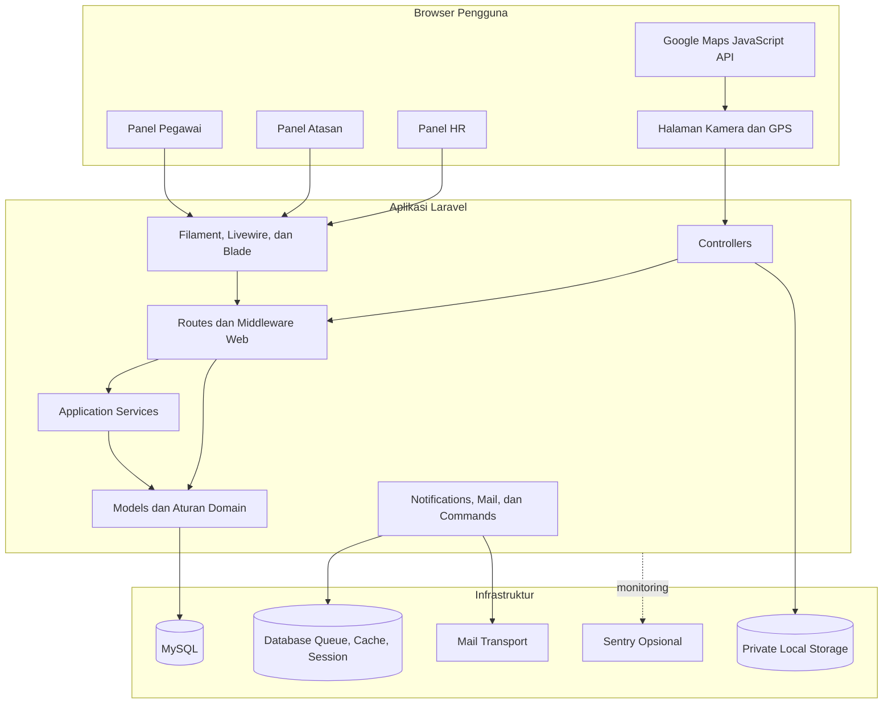
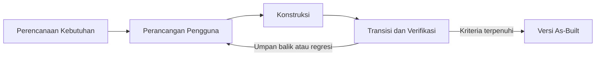

# BAB II

# METODOLOGI

## 2.1 Pendekatan Arsitektur Sistem

### 2.1.1 Modular Monolith

Sistem SDM diimplementasikan sebagai modular monolith berbasis Laravel. Seluruh panel, controller, service, model, notifikasi, command, dan laporan berjalan dalam satu aplikasi, memakai satu basis data, dan dirilis sebagai satu unit deployment. Pemisahan modul dilakukan pada struktur kode dan tanggung jawab kelas, bukan melalui layanan jaringan yang berdiri sendiri.

Pendekatan ini dipilih karena ruang lingkup aplikasi masih berada pada satu organisasi dan seluruh proses membutuhkan konsistensi data yang kuat. Transaksi lintas tabel dapat ditangani langsung oleh Laravel dan basis data tanpa mekanisme komunikasi terdistribusi. Operasi sistem juga lebih sederhana karena tidak memerlukan service discovery, API gateway, distributed tracing, atau orkestrasi banyak layanan.

### 2.1.2 Application Service Layer

Logika yang membutuhkan perhitungan atau koordinasi beberapa model ditempatkan pada service class. Komponen utama meliputi:

- `AttendanceRecorder` untuk validasi dan pencatatan absensi;
- `GeoDistance` untuk perhitungan jarak Haversine;
- `MeritCalculator` dan `MeritBatchCalculator` untuk perhitungan merit;
- `CareerGapService` untuk analisis kesenjangan kompetensi;
- `HrReportService` untuk menyusun data laporan lintas modul;
- `SqliteBackup` untuk backup dan pemulihan basis data SQLite pada lingkungan yang sesuai.

Pemisahan tersebut mengurangi duplikasi logika pada controller, command, dan komponen Filament. Walaupun nama dan tanggung jawabnya menyerupai layanan, seluruh class tetap dipanggil di dalam proses aplikasi yang sama.

### 2.1.3 Antarmuka dan Entry Point

Antarmuka utama terdiri atas tiga panel Filament:

- `/pegawai` untuk Pegawai;
- `/atasan` untuk Atasan;
- `/hr` untuk Admin SDM/HR.

Route Laravel biasa digunakan untuk halaman login, halaman pengambilan absensi, pengiriman data absensi, akses foto privat, dan laporan HR. Endpoint penyimpanan absensi mengembalikan JSON agar halaman browser dapat menampilkan hasil tanpa berpindah halaman, tetapi endpoint tersebut tetap berada pada middleware `web`, memakai session, CSRF, dan otorisasi pengguna. Endpoint ini bukan REST API independen.

### 2.1.4 Diagram Arsitektur Aktual

## 2.2 Metode Pengembangan Sistem

Pengembangan mengikuti pola iteratif Rapid Application Development (RAD). Metode ini sesuai untuk aplikasi yang banyak bergantung pada alur kerja dan antarmuka pengguna karena kebutuhan dapat divalidasi melalui implementasi kecil, pengujian, lalu perbaikan berulang.

### 2.2.1 Perencanaan Kebutuhan

Tahap perencanaan memetakan masalah utama, aktor, data, aturan bisnis, dan batas sistem. Hasil tahap ini mencakup:

1. identifikasi tiga peran pengguna;
2. pemetaan proses organisasi, dinas, absensi, merit, kompetensi, pelatihan, mentoring, dan laporan;
3. penentuan data sensitif seperti kata sandi, koordinat, foto, nilai, dan catatan penilaian;
4. identifikasi kebutuhan transaksi dan penguncian data pada proses yang dapat dijalankan bersamaan;
5. penetapan batas as-built agar fitur yang belum ada tidak dilaporkan sebagai implementasi.

### 2.2.2 Perancangan Pengguna

Tahap ini menerjemahkan kebutuhan menjadi panel, resource, form, tabel, widget, serta halaman khusus. Setiap peran memperoleh navigasi dan scope data berbeda. Alur yang melibatkan lebih dari satu aktor dimodelkan sebagai perubahan status, misalnya persetujuan pelatihan dan publikasi merit.

Rancangan juga mempertimbangkan perangkat bergerak untuk halaman absensi. Tombol pengambilan kamera dan GPS dibuat sebagai langkah eksplisit agar pengguna mengetahui data apa yang sedang diambil. Pesan validasi ditampilkan dalam bahasa Indonesia.

### 2.2.3 Konstruksi

Konstruksi dilakukan secara modular dengan urutan umum:

1. migration dan model data;
2. enum status dan aturan domain;
3. service untuk logika lintas model;
4. panel Filament, controller, Blade, dan JavaScript;
5. notifikasi, laporan, command, scheduler, dan backup;
6. feature test untuk alur utama dan kondisi gagal.

Perubahan dibangun mengikuti pola Laravel dan komponen yang sudah tersedia. Tidak digunakan arsitektur terdistribusi, autentikasi token, atau dependency frontend tambahan ketika kemampuan native browser dan framework sudah mencukupi.

### 2.2.4 Transisi dan Verifikasi

Tahap transisi memastikan implementasi dapat dijalankan pada lingkungan lokal dan perilaku utama sesuai kebutuhan. Verifikasi meliputi:

- migration dan seeding data awal;
- pengujian otomatis pada SQLite in-memory;
- pemeriksaan hak akses setiap panel dan record;
- pengujian alur lintas modul;
- pemeriksaan ekspor dan akses foto privat;
- format kode dengan Laravel Pint;
- pemeriksaan perubahan Git;
- pengujian manual browser dan perangkat untuk kamera, GPS, responsive layout, serta integrasi Google Maps.

## 2.3 Perangkat dan Teknologi Pengembangan

### 2.3.1 Bahasa dan Framework Backend

| Komponen | Implementasi aktif | Peran |
| --- | --- | --- |
| PHP | Requirement `^8.2` | Bahasa backend |
| Laravel | `12.64.0` | Framework aplikasi, autentikasi, validasi, ORM, queue, mail, scheduler |
| Filament | `5.6.8` | Panel, resource, form, table, widget, dan action |
| Livewire | `4.3.3` | Interaksi reaktif pada panel Filament |
| Blade | Bawaan Laravel | Template login, absensi, laporan, dan email |

### 2.3.2 Teknologi Frontend

| Komponen | Implementasi aktif | Peran |
| --- | --- | --- |
| Tailwind CSS | `4.3.2` | Styling aplikasi |
| Vite | `7.3.6` | Build aset frontend |
| Vanilla JavaScript | Native browser | Kamera, geolocation, watermark, dan submit absensi |
| Alpine.js | Disediakan ekosistem Filament | Interaksi ringan antarmuka |
| Axios | `1.18.1` | Dependency frontend tersedia pada proyek |

### 2.3.3 Basis Data dan Penyimpanan

MySQL merupakan basis data default aplikasi. Konfigurasi container lokal memakai image MySQL 8.4.10. PHPUnit memakai SQLite in-memory agar test cepat dan terisolasi. Session, cache, queue, dan notification menggunakan driver basis data. Foto absensi disimpan pada disk `local` dan tidak dipublikasikan langsung dari direktori web.

### 2.3.4 Peta, Lokasi, dan Kamera

Google Maps JavaScript API dan Places digunakan untuk pencarian serta pemilihan lokasi dinas. Browser Geolocation API membaca koordinat dan akurasi perangkat. MediaDevices API membuka kamera. Canvas browser dipakai untuk menghasilkan foto ber-watermark sebelum file dikirim ke server.

### 2.3.5 Laporan dan Ekspor

Laporan dapat ditampilkan pada halaman web dan diekspor menggunakan:

- `league/csv` untuk CSV;
- OpenSpout `4.32.0` untuk XLSX;
- `barryvdh/laravel-dompdf` `3.1.2` untuk PDF.

CSV dan XLSX dikirim sebagai streamed response. Nilai teks yang dapat dibaca spreadsheet sebagai formula dinetralkan sebelum ekspor.

### 2.3.6 Operasional dan Pengujian

| Komponen | Implementasi aktif | Peran |
| --- | --- | --- |
| PHPUnit | `11.5.56` | Unit dan feature test |
| Laravel Pint | `1.29.3` | Format kode PHP |
| GitHub Actions | Workflow proyek | Continuous integration |
| Sentry Laravel SDK | `4.27.0` | Monitoring bila DSN dikonfigurasi |
| Laravel Scheduler | Bawaan framework | Kalkulasi, pengingat, laporan, dan backup terjadwal |

### 2.3.7 Komponen yang Tidak Digunakan

Implementasi aktif tidak memakai `face-api.js`, Laravel Reverb, Laravel Sanctum, Laravel Socialite, Web Push, WhatsApp, service worker absensi, atau IndexedDB untuk antrean luring. Komponen tersebut tidak menjadi bagian rancangan as-built karena tidak ditemukan pada dependency, route, maupun alur aplikasi saat ini.
