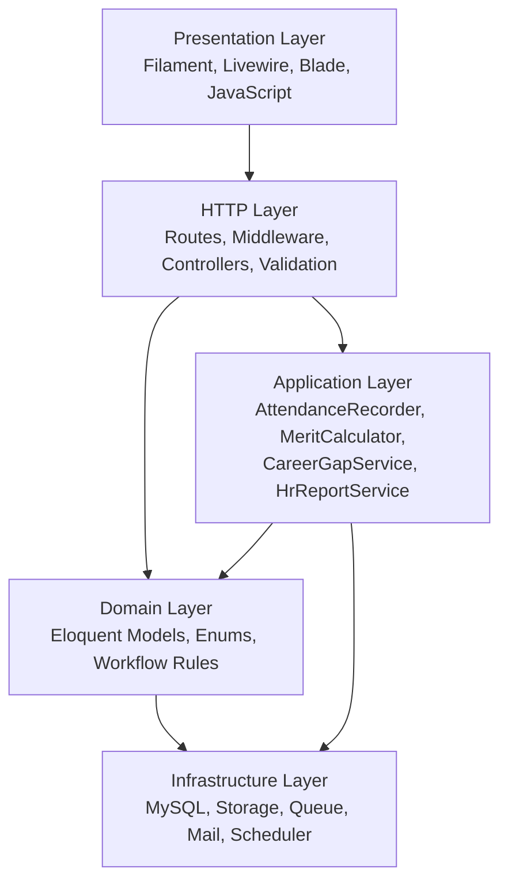
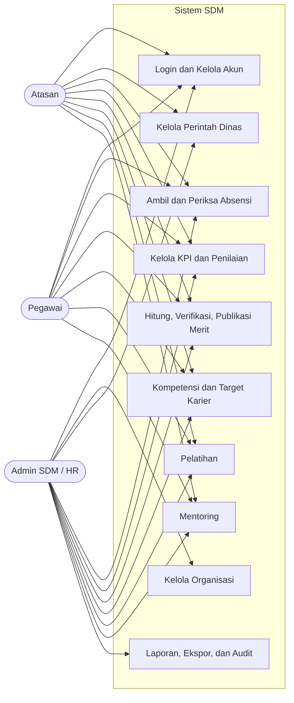
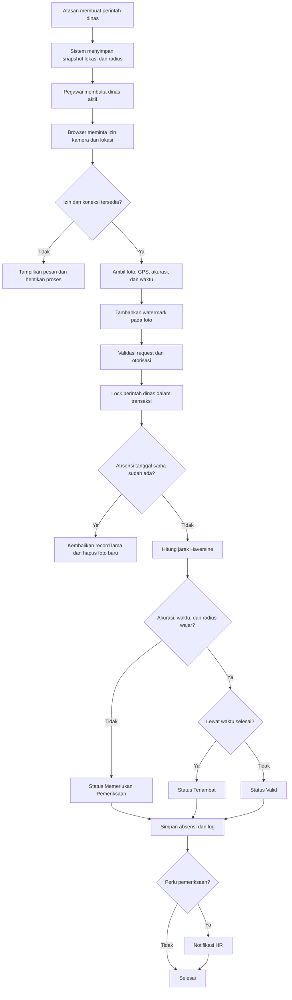
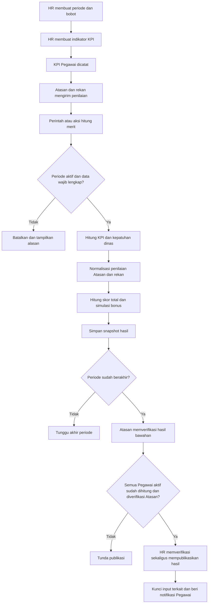
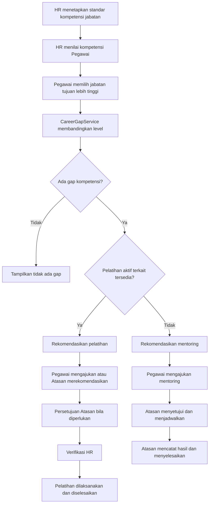
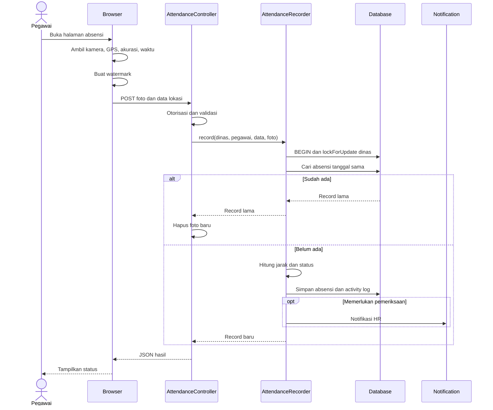
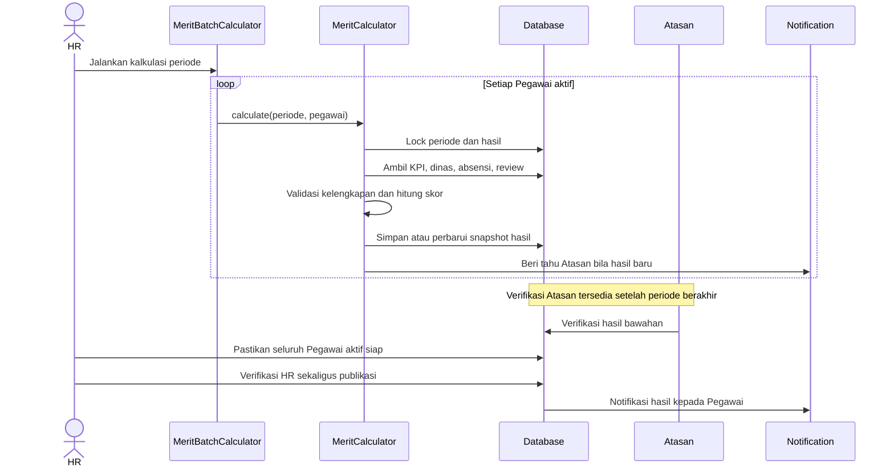
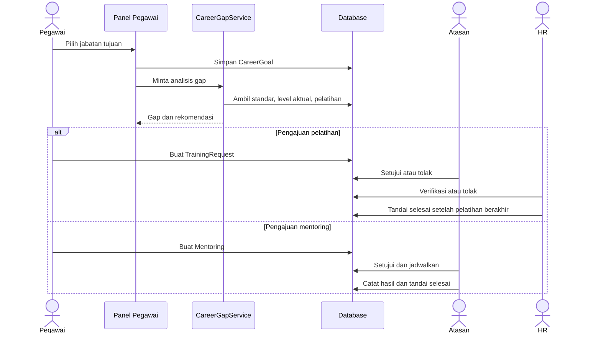
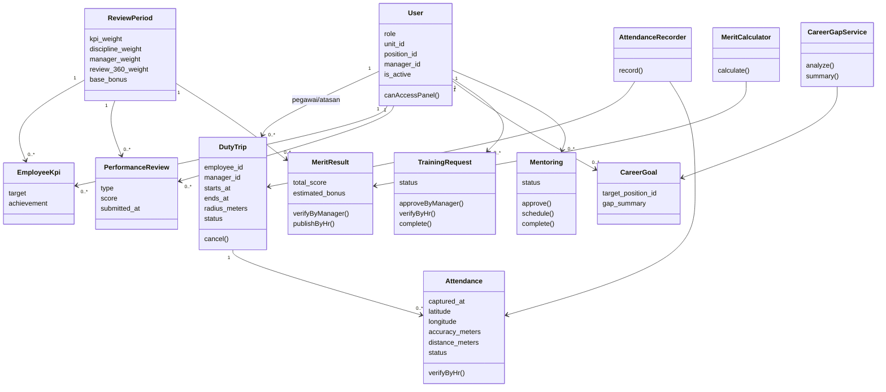
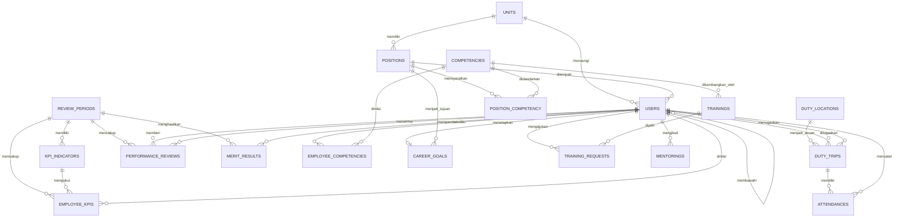

# BAB IV

# ANALISIS DAN PERANCANGAN SISTEM

## 4.1 Analisis Kebutuhan Sistem

### 4.1.1 Aktor Sistem

| Aktor | Tanggung jawab utama |
| --- | --- |
| Pegawai | Melihat tugas dan data pribadi, melakukan absensi dinas, melihat/mengisi KPI sesuai hak, mengirim umpan balik, memilih target karier, mengajukan pelatihan dan mentoring |
| Atasan | Mengelola dinas bawahan langsung, memantau absensi, mengelola KPI bawahan, memberi penilaian, memverifikasi merit, memproses pelatihan dan mentoring |
| Admin SDM/HR | Mengelola organisasi dan master data, memeriksa absensi, mengatur periode merit, memverifikasi/publikasi hasil, mengelola kompetensi dan pelatihan, melihat laporan serta audit |

Semua aktor menggunakan halaman login yang sama. Setelah autentikasi berhasil, sistem mengarahkan pengguna ke panel yang sesuai dengan perannya. Akun tidak aktif tidak dapat mengakses panel.

### 4.1.2 Kebutuhan Fungsional

| Kode | Kebutuhan fungsional | Aktor |
| --- | --- | --- |
| FR-AUT-01 | Sistem menyediakan login dan logout berbasis session | Semua |
| FR-AUT-02 | Sistem mengarahkan pengguna ke panel sesuai peran | Semua |
| FR-AUT-03 | Sistem menolak akun tidak aktif dan akses ke panel peran lain | Semua |
| FR-ORG-01 | HR mengelola unit, jabatan, akun, dan status aktif | HR |
| FR-ORG-02 | Sistem memastikan jabatan berasal dari unit pengguna | HR |
| FR-ORG-03 | Pegawai aktif wajib memiliki Atasan aktif | HR |
| FR-ORG-04 | Atasan yang masih mempunyai bawahan tidak dapat dinonaktifkan atau diubah menjadi peran lain | HR |
| FR-DIN-01 | HR mengelola lokasi dinas dan radius geofence | HR |
| FR-DIN-02 | Atasan membuat dinas hanya untuk bawahan langsung | Atasan |
| FR-DIN-03 | Lokasi dinas dapat dipilih melalui Google Maps dan disalin sebagai snapshot ke perintah dinas | Atasan |
| FR-DIN-04 | Atasan dapat mengubah atau membatalkan dinas hanya ketika aturan waktu dan status terpenuhi | Atasan |
| FR-DIN-05 | Pegawai, Atasan, dan HR melihat dinas sesuai scope masing-masing | Semua |
| FR-ABS-01 | Pegawai mengambil foto langsung melalui kamera browser | Pegawai |
| FR-ABS-02 | Halaman membaca koordinat, akurasi, dan waktu perangkat | Pegawai |
| FR-ABS-03 | Sistem menambahkan watermark pada bukti foto sebelum dikirim | Pegawai |
| FR-ABS-04 | Sistem menghitung jarak ke lokasi tugas dengan rumus Haversine | Sistem |
| FR-ABS-05 | Sistem menentukan status Valid, Terlambat, atau Memerlukan Pemeriksaan | Sistem |
| FR-ABS-06 | Pengiriman ulang pada dinas dan tanggal yang sama tidak membuat duplikat | Sistem |
| FR-ABS-07 | HR dapat memverifikasi absensi yang memerlukan pemeriksaan | HR |
| FR-ABS-08 | Foto hanya dapat dibuka oleh Pegawai pemilik, Atasan penugas, atau HR | Semua |
| FR-MER-01 | HR mengelola periode dan bobot komponen yang totalnya 100% | HR |
| FR-MER-02 | HR mengelola indikator KPI; total bobot indikator per periode wajib 100% sebelum kalkulasi | HR |
| FR-MER-03 | KPI dicatat untuk Pegawai dan Atasan yang mempunyai hubungan langsung | Pegawai/Atasan/HR |
| FR-MER-04 | Sistem menerima penilaian Atasan→Pegawai, Pegawai→Atasan, dan Rekan→Pegawai sesuai hubungan yang valid | Pegawai/Atasan |
| FR-MER-05 | Sistem menghitung skor KPI, kepatuhan dinas, penilaian Atasan, umpan balik rekan, total, dan simulasi bonus | Sistem/HR |
| FR-MER-06 | Hasil harus diverifikasi Atasan lalu HR sebelum dipublikasikan | Atasan/HR |
| FR-MER-07 | Hasil dan input periode terkunci setelah publikasi | Sistem |
| FR-KAR-01 | HR mengelola kamus kompetensi dan standar jabatan pada level 1–5 | HR |
| FR-KAR-02 | HR mencatat kompetensi Pegawai; akses baca mengikuti scope peran | HR/Semua |
| FR-KAR-03 | Pegawai memilih satu jabatan tujuan yang lebih tinggi | Pegawai |
| FR-KAR-04 | Sistem menghitung gap dan memberi rekomendasi pelatihan atau mentoring | Sistem |
| FR-PEL-01 | HR mengelola katalog pelatihan dan kompetensi terkait | HR |
| FR-PEL-02 | Pegawai mengajukan pelatihan untuk dirinya sendiri | Pegawai |
| FR-PEL-03 | Atasan menyetujui/menolak pengajuan atau merekomendasikan pelatihan dari hasil merit | Atasan |
| FR-PEL-04 | HR memverifikasi, menolak, dan menyelesaikan pelatihan sesuai status/waktu | HR |
| FR-MEN-01 | Pegawai mengajukan mentoring kepada Atasan langsung | Pegawai |
| FR-MEN-02 | Atasan menyetujui, menolak, menjadwalkan, dan menyelesaikan mentoring | Atasan |
| FR-OPS-01 | Sistem mengirim notifikasi database dan email untuk kejadian yang didukung | Sistem |
| FR-OPS-02 | HR melihat laporan lintas modul dengan filter dan pilihan kolom | HR |
| FR-OPS-03 | HR mengekspor laporan ke CSV, XLSX, dan PDF | HR |
| FR-OPS-04 | Sistem mencatat aktivitas penting pada audit log | Sistem/HR |
| FR-OPS-05 | Command dan scheduler mendukung kalkulasi, pengingat, laporan, dan backup | HR/Sistem |

### 4.1.3 Kebutuhan Nonfungsional

| Kode | Kebutuhan nonfungsional | Rancangan pemenuhan |
| --- | --- | --- |
| NFR-SEC-01 | Autentikasi dan otorisasi | Session, panel gate, middleware akun aktif, scope query, pemeriksaan aktor pada model/service |
| NFR-SEC-02 | Perlindungan request | CSRF, validasi Laravel, rate limit login dan submit absensi |
| NFR-SEC-03 | Perlindungan data sensitif | Password hashed; foto pada private local disk; akses foto diperiksa per request |
| NFR-DAT-01 | Konsistensi data | Foreign key, unique constraint, transaction, `lockForUpdate`, dan validasi domain |
| NFR-DAT-02 | Pencegahan duplikat | Idempotensi aplikasi dan unique constraint absensi per dinas/tanggal |
| NFR-USA-01 | Kemudahan penggunaan | Label serta pesan Indonesia, navigasi berdasarkan tugas peran, form responsif |
| NFR-USA-02 | Dukungan perangkat bergerak | Halaman absensi responsif dengan kamera dan geolocation browser |
| NFR-MNT-01 | Kemudahan pemeliharaan | Struktur Laravel, service class, enum status, shared resource Filament |
| NFR-OBS-01 | Keterlacakan | Activity log, database notification, mail log lokal, dan Sentry opsional |
| NFR-TST-01 | Kemampuan diuji | Factory, seeder idempoten, SQLite in-memory, unit dan feature test |
| NFR-EXP-01 | Keamanan ekspor | Scope HR, filter tervalidasi, dan netralisasi formula spreadsheet |

## 4.2 Perancangan Arsitektur Sistem

### 4.2.1 Pembagian Lapisan

Lapisan tersebut merupakan pembagian tanggung jawab di dalam satu aplikasi. Tidak ada komunikasi HTTP antarlayanan internal. Model tetap memuat invariant yang harus berlaku dari semua entry point, sedangkan service menangani use case yang menggabungkan beberapa model.

### 4.2.2 Siklus Request

1. Browser mengirim request melalui route `web`.
2. Middleware memeriksa session, status akun, CSRF, dan rate limit bila berlaku.
3. Filament page atau controller memeriksa hak akses dan memvalidasi input.
4. Application service atau model menjalankan aturan bisnis.
5. Perubahan persisten dijalankan dalam transaksi bila melibatkan state penting.
6. Activity log dan notifikasi dibuat sesuai kejadian.
7. Respons dikembalikan sebagai HTML, stream file, atau JSON untuk halaman absensi.

## 4.3 Pemodelan Sistem

### 4.3.1 Diagram Use Case

Mermaid belum mempunyai notasi use case UML khusus. Diagram berikut memakai flowchart untuk menunjukkan hubungan aktor dan kelompok fungsi.

### 4.3.2 Diagram Aktivitas Absensi Dinas

### 4.3.3 Diagram Aktivitas Sistem Merit

### 4.3.4 Diagram Aktivitas Pembinaan Karier

### 4.3.5 Diagram Urutan Absensi Dinas

### 4.3.6 Diagram Urutan Perhitungan Merit

### 4.3.7 Diagram Urutan Pembinaan Karier

### 4.3.8 Diagram Kelas Inti

### 4.3.9 Entity Relationship Diagram

Tabel operasional tambahan meliputi `activity_logs`, `notifications`, `approval_chains`, tabel queue, cache, dan session Laravel. Relasi audit bersifat polymorphic sehingga tidak ditampilkan sebagai foreign key tunggal pada diagram inti.

## 4.4 Perancangan UI/UX

### 4.4.1 Halaman Login

Halaman login menjadi entry point tunggal. Form hanya meminta email dan kata sandi, memakai rate limit, menampilkan validasi Indonesia, serta mengarahkan pengguna ke panel berdasarkan peran.

> [PLACEHOLDER GAMBAR 4.1 — Halaman login versi implementasi aktif]

### 4.4.2 Panel Pegawai

Panel Pegawai menekankan tugas yang harus dilakukan pengguna: dinas aktif dan status absensi, KPI, hasil merit terpublikasi, kompetensi, target karier, katalog dan pengajuan pelatihan, serta mentoring. Record dibatasi pada data milik Pegawai.

> [PLACEHOLDER GAMBAR 4.2 — Dashboard dan navigasi Panel Pegawai]

### 4.4.3 Panel Atasan

Panel Atasan menampilkan konteks bawahan langsung. Navigasi mencakup perintah dinas, riwayat absensi, KPI, penilaian, hasil merit, kompetensi dan target karier bawahan, pengajuan pelatihan, serta mentoring.

> [PLACEHOLDER GAMBAR 4.3 — Dashboard dan navigasi Panel Atasan]

### 4.4.4 Panel HR

Panel HR menyediakan data organisasi, monitoring operasional, konfigurasi merit, pengembangan karier, laporan, dan audit. Aksi ditampilkan sesuai state record agar pengguna tidak menjalankan transisi yang tidak sah.

> [PLACEHOLDER GAMBAR 4.4 — Dashboard dan navigasi Panel HR]

### 4.4.5 Halaman Absensi Mobile

Halaman absensi dibuat terpisah dari form Filament agar interaksi kamera dan lokasi lebih jelas. Urutan tindakan adalah membuka kamera, mengambil foto, mengambil lokasi, meninjau data, lalu mengirim absensi. Saat luring, halaman meminta pengguna menyambungkan internet dan mencoba kembali.

> [PLACEHOLDER GAMBAR 4.5 — Halaman pengambilan absensi pada perangkat bergerak]
