# LAPORAN PROYEK AKHIR

# SISTEM SDM BERBASIS WEB

## Pengelolaan Absensi Dinas, Sistem Merit, dan Pembinaan Karier dalam Satu Aplikasi Modular

---

> [PLACEHOLDER COVER — Judul, identitas penyusun, NIM, institusi, dan tahun penyusunan]
>
> [PLACEHOLDER LEMBAR PENGESAHAN — Nama, NIM, judul, tanda tangan dosen pembimbing dan penguji sesuai format kampus]
>
> [PLACEHOLDER LEMBAR PERNYATAAN ORISINALITAS — Pernyataan bahwa laporan bebas plagiarisme dengan tanda tangan penyusun]

---

# ABSTRAK

Sistem SDM berbasis web dikembangkan untuk mengatasi permasalahan pengelolaan sumber daya manusia yang datanya tersebar pada proses dan aplikasi terpisah, khususnya pada absensi perjalanan dinas, penilaian kinerja berbasis merit, dan pembinaan karier. Absensi dinas belum memadai karena pencatatan kehadiran tidak terhubung dengan perintah dinas, lokasi, dan waktu tugas. Penilaian kinerja belum terukur karena komponen KPI, kepatuhan dinas, penilaian Atasan, dan umpan balik rekan tidak dihitung dari satu sumber yang dapat direproduksi. Pembinaan karier juga belum berbasis kesenjangan kompetensi terhadap jabatan tujuan.

Metode pengembangan yang digunakan adalah Rapid Application Development (RAD) dengan arsitektur modular monolith dan application service layer berbasis Laravel dan Filament. Sistem memiliki tiga panel berbasis peran, yaitu Pegawai, Atasan, dan Admin SDM/HR, yang berjalan pada satu aplikasi, satu basis data, dan satu unit deployment. Validasi absensi menggabungkan radius geofencing rumus Haversine, akurasi GPS, waktu perangkat, dan foto ber-watermark. Merit dihitung dari empat komponen berbobot dengan verifikasi dua tahap sebelum publikasi. Pembinaan karier dianalisis melalui perbandingan standar jabatan tujuan dengan kompetensi aktual.

Hasil pengujian otomatis pada 9 Agustus 2026 menghasilkan 105 test lulus dengan 603 assertion tanpa kegagalan. Sistem diverifikasi pada level unit, HTTP, model, service, database, dan Livewire. Pengujian kamera dan GPS pada perangkat fisik, browser penuh, serta load test tetap diperlukan sebelum deployment production. Dapat disimpulkan bahwa tujuan proyek tercapai pada batas as-built, mencakup integrasi absensi dinas, sistem merit, dan pembinaan karier dalam satu aplikasi web.

**Kata kunci:** Sistem SDM, absensi dinas berbasis GPS, sistem merit, modular monolith, pembinaan karier, Laravel, Filament.

# ABSTRACT

A web-based HR system was developed to address the problem of human resource data scattered across separate processes and applications, particularly in official travel attendance, merit-based performance appraisal, and career development. Official travel attendance was inadequate because attendance recording was not linked to duty orders, location, and task schedule. Performance appraisal was not measurable because KPI, duty compliance, manager ratings, and peer feedback were not computed from a single reproducible source. Career development was also not based on competency gaps against the target position.

The development method used Rapid Application Development (RAD) with a modular monolith architecture and an application service layer built on Laravel and Filament. The system provides three role-based panels — Employee, Manager, and HR Admin — running in one application, one database, and one deployment unit. Attendance validation combines Haversine distance geofencing, GPS accuracy, device time, and watermarked photos. Merit is calculated from four weighted components with two-stage verification before publication. Career development is analyzed by comparing the target position standard with actual competencies.

Automated testing on August 9, 2026 produced 105 passing tests with 603 assertions and zero failures. The system was verified at the unit, HTTP, model, service, database, and Livewire levels. Camera and GPS testing on physical devices, full browser automation, and load testing remain required before production deployment. It can be concluded that the project objectives were achieved within the as-built scope, covering the integration of official travel attendance, merit system, and career development in a single web application.

**Keywords:** HR management system, GPS-based official travel attendance, merit system, modular monolith, career development, Laravel, Filament.

---

# KATA PENGANTAR

Puji dan syukur penulis panjatkan kepada Tuhan Yang Maha Esa atas rahmat-Nya sehingga laporan proyek akhir yang berjudul Sistem SDM Berbasis Web ini dapat diselesaikan. Laporan ini disusun untuk mendokumentasikan analisis, perancangan, implementasi, dan pengujian sistem pengelolaan absensi dinas, sistem merit, dan pembinaan karier dalam satu aplikasi web.

Penulis menyampaikan terima kasih kepada dosen pembimbing, dosen penguji, pihak organisasi yang menjadi subjek studi, serta seluruh pihak yang telah memberikan arahan dan dukungan selama penyusunan laporan ini. Sistem dibangun mengikuti pola Rapid Application Development sehingga dokumentasi disesuaikan dengan implementasi aktif yang dapat diverifikasi melalui pengujian otomatis.

Penulis menyadari bahwa laporan ini masih memiliki keterbatasan, terutama pada cakupan pengujian perangkat keras dan infrastruktur production. Saran dan kritik yang membangun sangat diharapkan untuk penyempurnaan pada pengembangan berikutnya. Semoga laporan ini bermanfaat bagi pembaca yang membutuhkan.

---

# DAFTAR ISI

1. **BAB I — PENDAHULUAN**
   - 1.1 Latar Belakang
   - 1.2 Identifikasi Masalah
   - 1.3 Rumusan Masalah
   - 1.4 Tujuan Proyek
   - 1.5 Manfaat Proyek
   - 1.6 Batasan Proyek
   - 1.7 Sistematika Penulisan
2. **BAB II — METODOLOGI**
   - 2.1 Pendekatan Arsitektur Sistem
   - 2.2 Metode Pengembangan Sistem
   - 2.2.1 Perencanaan Kebutuhan
   - 2.2.2 Perancangan Pengguna
   - 2.2.3 Konstruksi
   - 2.2.4 Transisi dan Verifikasi
   - 2.2.5 Jadwal Tahapan Pengembangan
   - 2.3 Perangkat dan Teknologi Pengembangan
3. **BAB III — TINJAUAN PUSTAKA**
   - 3.1 Kajian Sistem Sejenis
   - 3.2 Landasan Teori
   - 3.3 Definisi Istilah Penting
4. **BAB IV — ANALISIS DAN PERANCANGAN SISTEM**
   - 4.1 Analisis Kebutuhan Sistem
     - 4.1.1 Aktor, 4.1.2 Kebutuhan Fungsional, 4.1.3 Kebutuhan Nonfungsional
     - 4.1.4 Pemetaan Kebutuhan terhadap Tujuan Khusus
   - 4.2 Perancangan Arsitektur Sistem
   - 4.3 Pemodelan Sistem
     - 4.3.1–4.3.9 Diagram Pemodelan (Use Case, Aktivitas, Urutan, Kelas, ERD)
     - 4.3.10 Rancangan Struktur Tabel Inti
   - 4.4 Perancangan UI/UX
5. **BAB V — IMPLEMENTASI SISTEM**
   - 5.1 Struktur Implementasi
     - 5.1.1 Struktur Aplikasi, 5.1.2 Pola Validasi, 5.1.3 Transaksi dan Penguncian
     - 5.1.4 Potongan Kode Inti
   - 5.2 Implementasi Modul
   - 5.3 Tangkapan Layar Implementasi
6. **BAB VI — HASIL DAN PEMBAHASAN**
   - 6.1 Hasil Pengujian Sistem
     - 6.1.1–6.1.4 Lingkungan, Inventaris, Matriks Skenario, Pengujian Manual
     - 6.1.5 Verifikasi Formula Secara Manual
   - 6.2 Pembahasan
   - 6.3 Keterbatasan Hasil
7. **BAB VII — PENUTUP**
   - 7.1 Kesimpulan
   - 7.2 Saran
8. **DAFTAR PUSTAKA**
9. **LAMPIRAN**

# DAFTAR TABEL

| No. | Judul tabel | Lokasi |
| --- | --- | --- |
| 2.1 | Bahasa dan framework backend | Bab II, 2.3.1 |
| 2.2 | Teknologi frontend | Bab II, 2.3.2 |
| 2.3 | Operasional dan pengujian | Bab II, 2.3.6 |
| 3.1 | Posisi Sistem SDM terhadap sistem sejenis | Bab III, 3.1.5 |
| 4.1 | Aktor sistem | Bab IV, 4.1.1 |
| 4.2 | Kebutuhan fungsional | Bab IV, 4.1.2 |
| 4.3 | Kebutuhan nonfungsional | Bab IV, 4.1.3 |
| 4.4 | Pemetaan kebutuhan terhadap tujuan khusus | Bab IV, 4.1.4 |
| 5.1 | Struktur aplikasi | Bab V, 5.1.1 |
| 5.2 | Prioritas status absensi | Bab V, 5.2.4 |
| 6.1 | Inventaris pengujian otomatis | Bab VI, 6.1.2 |
| 6.2 | Matriks skenario representatif | Bab VI, 6.1.3 |
| 6.3 | Pengujian manual yang tetap diperlukan | Bab VI, 6.1.4 |

# DAFTAR GAMBAR

| No. | Judul gambar | Lokasi |
| --- | --- | --- |
| 2.1 | Diagram arsitektur aktual | Bab II, 2.1.4 |
| 2.2 | Siklus metode RAD | Bab II, 2.2 |
| 4.1 | Halaman login | Bab IV, 4.4.1 |
| 4.2 | Dashboard Panel Pegawai | Bab IV, 4.4.2 |
| 4.3 | Dashboard Panel Atasan | Bab IV, 4.4.3 |
| 4.4 | Dashboard Panel HR | Bab IV, 4.4.4 |
| 4.5 | Halaman absensi pada perangkat bergerak | Bab IV, 4.4.5 |
| 5.1–5.6 | Tangkapan layar implementasi | Bab V, 5.3 |
| 6.1–6.3 | Bukti pengujian | Bab VI, 6.1.4 |

---

# BAB I

# PENDAHULUAN

## 1.1 Latar Belakang

Pengelolaan sumber daya manusia membutuhkan data yang akurat, dapat ditelusuri, dan tersedia bagi pihak yang tepat. Pada proses manual atau aplikasi yang terpisah, data penugasan, kehadiran, kinerja, dan pengembangan pegawai sering tidak memiliki hubungan yang jelas. Kondisi tersebut menyulitkan organisasi saat memeriksa keabsahan kehadiran dinas, mengevaluasi kinerja, dan menentukan tindak lanjut pengembangan karier.

Absensi dinas memiliki kebutuhan yang berbeda dari absensi harian di kantor. Pegawai bekerja pada lokasi dan waktu yang ditentukan melalui suatu perintah dinas. Pencatatan kehadiran berbasis waktu saja belum cukup karena tidak membuktikan kedekatan pegawai dengan lokasi tugas. Bukti foto tanpa koordinat juga masih memerlukan pemeriksaan manual yang besar. Oleh karena itu, pencatatan absensi dinas perlu menggabungkan jadwal tugas, koordinat GPS, akurasi pembacaan lokasi, jarak dari titik tugas, waktu pengambilan, dan foto sebagai satu rekam data.

Penilaian kinerja juga membutuhkan dasar yang lebih terukur. Nilai akhir yang hanya berasal dari pendapat satu pihak berisiko tidak menggambarkan capaian pegawai secara menyeluruh. Sistem perlu menggabungkan capaian indikator kinerja utama, kepatuhan terhadap tugas dinas, penilaian Atasan, dan umpan balik rekan. Bobot setiap komponen perlu dapat ditetapkan per periode, sedangkan hasilnya perlu melewati verifikasi sebelum dipublikasikan kepada pegawai.

Pengembangan karier seharusnya mengikuti kesenjangan kompetensi nyata. Pegawai perlu mengetahui perbedaan antara kompetensi yang dimiliki dan standar jabatan tujuan. Atasan serta HR kemudian dapat memakai informasi tersebut untuk memberikan rekomendasi pelatihan atau mentoring yang relevan. Tanpa hubungan antara data kompetensi, hasil merit, pelatihan, dan mentoring, pembinaan karier cenderung bersifat umum dan sulit dievaluasi.

Berdasarkan kebutuhan tersebut, dikembangkan **Sistem SDM** berbasis web. Sistem ini mengintegrasikan tiga kelompok modul utama:

1. **Perjalanan dinas dan absensi**, berupa pengelolaan perintah dinas dan pencatatan kehadiran berbasis GPS serta foto;
2. **KPI dan merit**, berupa sistem penilaian kinerja dan simulasi bonus berdasarkan hasil penilaian;
3. **Pengembangan karier**, berupa pemetaan kompetensi, target karier, pelatihan, dan mentoring.

Implementasi saat ini menggunakan satu aplikasi Laravel dengan tiga panel berbasis peran: Pegawai, Atasan, dan Admin SDM/HR. Seluruh modul berjalan pada satu basis data dan satu unit deployment. Logika bisnis utama dipisahkan ke dalam service class agar tanggung jawab setiap modul tetap terstruktur. Bentuk ini merupakan **modular monolith dengan application service layer**, bukan kumpulan layanan independen atau REST API yang dapat di-deploy terpisah.

## 1.2 Identifikasi Masalah

Masalah yang menjadi dasar pengembangan sistem adalah sebagai berikut.

Kelima masalah dikelompokkan berdasarkan area proses SDM yang ditangani, yaitu validasi kehadiran dinas, penilaian kinerja dan merit, pembinaan karier, pengendalian alur persetujuan, serta keterhubungan data antarfungsi. Pengelompokan ini disusun agar setiap masalah dapat ditelusuri ke tujuan khusus dan rancangan modul yang bersesuaian pada Bab IV.

### 1.2.1 Validasi Kehadiran Dinas Belum Memadai

Pencatatan kehadiran tanpa hubungan dengan perintah dinas, lokasi, dan waktu tugas tidak cukup untuk memastikan bahwa pegawai hadir pada tempat yang ditentukan. Sistem memerlukan pemeriksaan radius, akurasi GPS, perbedaan waktu perangkat dan server, serta bukti foto yang hanya dapat diakses pengguna berwenang.

Apabila kehadiran tidak dapat dipertanggungjawabkan secara objektif, perintah dinas berisiko disalahgunakan dan hasil evaluasi kinerja menjadi tidak adil bagi pegawai lain. Validasi yang terlalu longgar juga memperbesar beban pemeriksaan manual HR sehingga kesalahan dapat luput dari pengawasan. Oleh karena itu, absensi dinas menuntut rekam data gabungan yang memungkinkan setiap kehadiran ditelusuri sejak pengambilan bukti hingga penetapan status.

### 1.2.2 Penilaian Kinerja Belum Terukur dan Terpadu

Data KPI, kepatuhan dinas, penilaian Atasan, dan umpan balik rekan dapat tersebar pada media berbeda. Akibatnya, perhitungan nilai sulit direproduksi dan keputusan tidak mempunyai jejak audit yang memadai.

Perbedaan sumber data menyebabkan dua pihak dapat memperoleh hasil yang berbeda untuk proses yang sama, sehingga objektivitas penilaian dipertanyakan. Tanpa jejak audit, pegawai juga kesulitan memahami dasar nilai yang diterimanya. Sistem perlu menyatukan seluruh komponen penilaian pada satu periode yang jelas dengan formula dan tahapan yang dapat diverifikasi.

### 1.2.3 Pembinaan Karier Belum Berbasis Kesenjangan Kompetensi

Pegawai belum memperoleh gambaran terstruktur mengenai kompetensi yang harus ditingkatkan untuk mencapai jabatan tujuan. Pada praktik saat ini, usulan pelatihan cenderung muncul tanpa perbandingan sistematis antara kompetensi aktual dan standar jabatan, sehingga pelatihan dan mentoring berisiko diberikan tanpa hubungan langsung dengan kebutuhan kompetensi.

Pengembangan yang tidak berbasis data cenderung bersifat umum, sulit dievaluasi, dan kurang sejalan dengan kebutuhan jabatan. Sistem perlu membandingkan level kompetensi aktual dengan standar jabatan tujuan sehingga rekomendasi pengembangan dapat diarahkan pada pelatihan atau mentoring yang paling relevan.

### 1.2.4 Persetujuan dan Publikasi Belum Terkendali

Pengajuan pelatihan, mentoring, verifikasi merit, dan pemeriksaan absensi melibatkan beberapa peran. Tanpa aturan status dan pembatasan aktor, data dapat berubah pada tahap yang tidak semestinya atau disetujui oleh pihak yang tidak berwenang.

Perubahan status yang tidak terkendali dapat menghasilkan keputusan yang tidak sah dan menyulitkan pelacakan tanggung jawab. Oleh karena itu, setiap alur yang melibatkan lebih dari satu aktor perlu dimodelkan sebagai proses berstatus dengan pemeriksaan peran, kepemilikan, dan waktu.

### 1.2.5 Data Antarfungsi SDM Belum Terhubung

Keputusan HR membutuhkan pandangan terpadu terhadap organisasi, absensi dinas, merit, pelatihan, dan mentoring. Setiap fungsi saat itu mengelola data pada media terpisah, sehingga riwayat aktivitas kepegawaian tersebar dan tidak dapat dirangkai menjadi satu sumber riwayat yang utuh. Data yang terpisah tersebut menghambat penyusunan laporan dan pelacakan riwayat aktivitas.

Keterpisahan data juga menyulitkan penyusunan kebijakan karena informasi yang diperlukan tersebar di beberapa tempat. Sistem perlu menjaga hubungan data lintas fungsi dan mencatat aktivitas penting sehingga laporan dan audit dapat disusun dari satu sumber yang utuh.

## 1.3 Rumusan Masalah

Rumusan masalah proyek ini adalah sebagai berikut.

1. Bagaimana membangun sistem web terintegrasi untuk mengelola organisasi, perintah dinas, absensi dinas, merit, dan pengembangan karier dalam satu aplikasi?
2. Bagaimana memvalidasi absensi dinas menggunakan jadwal tugas, GPS, akurasi lokasi, radius geofencing, waktu perangkat, dan foto tanpa mengklaim verifikasi biometrik?
3. Bagaimana menghitung merit berdasarkan KPI, kepatuhan dinas, penilaian Atasan, dan umpan balik rekan dengan bobot yang dapat ditetapkan per periode?
4. Bagaimana menghubungkan standar jabatan, kompetensi pegawai, target karier, pelatihan, serta mentoring untuk menghasilkan rekomendasi pengembangan?
5. Bagaimana membatasi panel, data, aksi, foto, persetujuan, dan publikasi sesuai peran Pegawai, Atasan, serta HR?
6. Bagaimana menyediakan laporan, ekspor, notifikasi, audit aktivitas, dan backup yang mendukung operasi sistem?

## 1.4 Tujuan Proyek

### 1.4.1 Tujuan Umum

Membangun Sistem SDM yang mengintegrasikan pengelolaan absensi dinas, sistem merit, dan pembinaan karier dalam satu aplikasi berbasis web.

Pemilihan wujud satu aplikasi bukan sekadar penggabungan tampilan, melainkan diarahkan pada satu basis data dan satu unit deployment untuk seluruh fungsi. Dengan cara ini, alur yang memotong beberapa fungsi, seperti absensi dinas yang menjadi bahan penilaian, hasil merit yang menjadi masukan rekomendasi pelatihan, serta data kompetensi yang menjadi dasar target karier, dapat saling terhubung tanpa perantara pemindahan data manual. Tujuan umum ini sekaligus menjawab masalah keterpisahan data antarfungsi yang diuraikan pada bagian 1.2.5.

### 1.4.2 Tujuan Khusus

1. Menyediakan autentikasi terpusat dan panel sesuai peran pengguna.
2. Menyediakan pengelolaan unit, jabatan, akun, serta hubungan Atasan–Pegawai.
3. Menyediakan pembuatan dan pemantauan perintah dinas berdasarkan bawahan langsung.
4. Mencatat absensi dinas menggunakan lokasi GPS, akurasi, foto kamera, watermark, waktu, dan validasi radius.
5. Menyediakan pemeriksaan HR untuk absensi dengan data lokasi atau waktu yang meragukan.
6. Mengelola periode penilaian, indikator KPI, capaian pegawai, penilaian kinerja, serta hasil merit.
7. Menyediakan verifikasi hasil merit oleh Atasan dan HR sebelum publikasi.
8. Menampilkan simulasi bonus berdasarkan skor merit tanpa memproses pembayaran.
9. Menganalisis kesenjangan kompetensi terhadap jabatan tujuan.
10. Mendukung alur pengajuan, rekomendasi, persetujuan, penolakan, dan penyelesaian pelatihan serta mentoring.
11. Menyediakan laporan HR, ekspor CSV/XLSX/PDF, notifikasi, audit aktivitas, scheduler, dan backup.
12. Memastikan aturan bisnis penting terlindungi oleh validasi, transaksi basis data, pembatasan akses, dan pengujian otomatis.

## 1.5 Manfaat Proyek

### 1.5.1 Manfaat bagi Pegawai

Pegawai memperoleh satu portal untuk melihat tugas dinas, melakukan absensi, memantau KPI dan merit yang telah dipublikasikan, melihat profil kompetensi, menentukan target karier, mengajukan pelatihan, dan mengikuti mentoring. Dengan satu portal tersebut, pegawai tidak perlu berpindah aplikasi untuk mengelola seluruh aktivitas kepegawaian. Transparansi hasil penilaian dan rekomendasi pengembangan memberi pegawai gambaran yang jelas mengenai posisi dan peluang kenaikan kariernya.

Keberhasilan manfaat ini dapat diukur dari kemampuan pegawai melacak status pengajuan dan hasil penilaian secara mandiri, tanpa harus menanyakan ulang kepada Atasan atau HR, serta memperoleh rekomendasi pengembangan yang tertaut langsung pada kebutuhan kompetensinya.

### 1.5.2 Manfaat bagi Atasan

Atasan dapat mengelola penugasan bawahan langsung, memantau absensi, mencatat KPI, memberikan penilaian, memverifikasi merit, menindaklanjuti pengajuan pelatihan, merekomendasikan pelatihan berdasarkan hasil merit, dan mengelola mentoring. Kemudahan tersebut menempatkan seluruh proses pembinaan dalam satu alur yang terpantau. Keputusan penugasan dan pengembangan bawahan menjadi lebih cepat karena didukung data yang tersedia pada panel Atasan.

Keberhasilan manfaat ini ditandai dengan perpindahan pekerjaan penilaian dan verifikasi dari berkas manual ke panel terpusat, serta kemampuan Atasan menelusuri dasar setiap penilaian yang diberikannya tanpa mencari data lintas aplikasi.

### 1.5.3 Manfaat bagi HR

HR memperoleh pengelolaan data organisasi dan master, pemeriksaan absensi, pengaturan periode merit, verifikasi serta publikasi hasil, pemeliharaan kompetensi dan katalog pelatihan, laporan lintas modul, ekspor, audit aktivitas, dan dukungan backup. Laporan dan audit yang terpusat mengurangi pekerjaan rekonsiliasi manual. Pemeriksaan absensi yang terintegrasi dengan bukti lokasi dan foto memperkuat dasar keputusan administrasi kepegawaian.

Keberhasilan manfaat ini diukur dari kemampuan HR menyusun laporan lintas fungsi dari satu basis data, melacak jejak aktivitas penting (audit), serta memeriksa kehadiran dengan bukti lokasi dan foto tanpa bergantung pada media terpisah.

### 1.5.4 Manfaat Akademis

Proyek menjadi contoh penerapan modular monolith pada aplikasi Laravel yang menggabungkan antarmuka berbasis peran, transaksi untuk workflow, geofencing, perhitungan merit, analisis kompetensi, dan pengujian integrasi. Laporan ini mendokumentasikan kompromi desain antara kebutuhan fungsional dan batasan implementasi nyata. Hasil pengujian otomatis turut menjadi rujukan praktik pengujian fitur pada aplikasi berbasis Filament dan Livewire.

Manfaat akademis bagi pengembang maupun peneliti berikutnya adalah memperoleh gambaran nyata tentang keputusan pemilihan satu basis data dan satu unit deployment bagi kebutuhan yang selama ini digabungkan secara manual, berikut titik-titik penetapan status pada absensi dinas dan merit yang perlu dijaga oleh transaksi basis data agar hasil tetap dapat diverifikasi.

## 1.6 Batasan Proyek

Batasan sistem berdasarkan implementasi aktif adalah sebagai berikut.

1. Sistem berbentuk aplikasi web untuk satu organisasi dan belum mendukung multi-tenant.
2. Pengguna dibatasi pada tiga peran: Pegawai, Atasan, dan Admin SDM/HR.
3. Absensi yang dikelola adalah absensi perjalanan dinas, bukan presensi harian seluruh pegawai.
4. Absensi memerlukan koneksi internet saat data dikirim. Tidak ada antrean luring, IndexedDB, atau service worker untuk sinkronisasi absensi.
5. Foto digunakan sebagai bukti visual privat. Sistem tidak melakukan pengenalan wajah, pencocokan biometrik, atau deteksi identitas.
6. Sistem memakai Browser Geolocation API dan tidak mendeteksi pemalsuan lokasi pada tingkat sistem operasi perangkat.
7. Google Maps digunakan untuk pencarian dan pemilihan lokasi dinas; ketersediaannya bergantung pada konfigurasi API key dan layanan eksternal Google.
8. Status absensi aktif adalah `Valid`, `Terlambat`, dan `Memerlukan Pemeriksaan`. Lokasi di luar radius menghasilkan status pemeriksaan, bukan status khusus `OutsideRadius`.
9. Penilaian merit memakai KPI, kepatuhan dinas, penilaian Atasan, dan umpan balik rekan. Penilaian Pegawai kepada Atasan disimpan sebagai umpan balik, tetapi tidak menjadi skor rekan bagi Pegawai.
10. Nilai bonus bersifat simulasi berdasarkan dasar bonus periode dan tidak terhubung ke payroll atau transaksi pembayaran.
11. Notifikasi aktif menggunakan database dan email pada kejadian tertentu. Sistem tidak menyediakan Web Push, WhatsApp, WebSocket, atau preferensi kanal per pengguna.
12. Antarmuka menggunakan autentikasi session. Tidak ada REST API independen, Laravel Sanctum, atau login sosial melalui Laravel Socialite.
13. Penyimpanan utama ditujukan untuk MySQL, sedangkan pengujian otomatis memakai SQLite in-memory.
14. Pengujian otomatis mencakup level unit, HTTP, model, service, dan Livewire. Otomasi browser penuh serta pengujian kamera/GPS pada perangkat fisik belum menjadi bagian suite otomatis.

## 1.7 Sistematika Penulisan

Laporan disusun dalam tujuh bab dengan sistematika sebagai berikut.

- **Bab I Pendahuluan** menjelaskan latar belakang, identifikasi masalah, rumusan masalah, tujuan, manfaat, batasan proyek, dan sistematika penulisan.
- **Bab II Metodologi** menguraikan pendekatan arsitektur modular monolith, metode pengembangan RAD, serta perangkat dan teknologi yang digunakan.
- **Bab III Tinjauan Pustaka** membahas kajian sistem sejenis dan landasan teori yang mendasari perancangan sistem.
- **Bab IV Analisis dan Perancangan Sistem** menyajikan kebutuhan fungsional dan nonfungsional, arsitektur, pemodelan sistem, perancangan basis data, serta perancangan UI/UX.
- **Bab V Implementasi Sistem** menjelaskan struktur implementasi, penerapan setiap modul, dan tangkapan layar.
- **Bab VI Hasil dan Pembahasan** menampilkan hasil pengujian, verifikasi formula, pembahasan, dan keterbatasan hasil.
- **Bab VII Penutup** memuat kesimpulan dan saran pengembangan berikutnya.

Bagian akhir laporan memuat daftar pustaka dan lampiran pendukung.

---

# BAB II

# METODOLOGI

## 2.1 Pendekatan Arsitektur Sistem

### 2.1.1 Modular Monolith

Sistem SDM diimplementasikan sebagai modular monolith berbasis Laravel. Seluruh panel, controller, service, model, notifikasi, command, dan laporan berjalan dalam satu aplikasi, memakai satu basis data, dan dirilis sebagai satu unit deployment. Pemisahan modul dilakukan pada struktur kode dan tanggung jawab kelas, bukan melalui layanan jaringan yang berdiri sendiri.

Pendekatan ini dipilih karena ruang lingkup aplikasi masih berada pada satu organisasi dan seluruh proses membutuhkan konsistensi data yang kuat. Transaksi lintas tabel dapat ditangani langsung oleh Laravel dan basis data tanpa mekanisme komunikasi terdistribusi. Operasi sistem juga lebih sederhana karena tidak memerlukan service discovery, API gateway, distributed tracing, atau orkestrasi banyak layanan.

### 2.1.2 Application Service Layer

Logika yang membutuhkan perhitungan atau koordinasi beberapa model ditempatkan pada service class. Komponen utama meliputi:

- `AttendanceRecorder` untuk validasi dan pencatatan absensi;
- `GeoDistance` untuk perhitungan jarak Haversine;
- `MeritCalculator` dan `MeritBatchCalculator` untuk perhitungan merit;
- `CareerGapService` untuk analisis kesenjangan kompetensi;
- `HrReportService` untuk menyusun data laporan lintas modul.

Pemisahan tersebut mengurangi duplikasi logika pada controller, command, dan komponen Filament. Walaupun nama dan tanggung jawabnya menyerupai layanan, seluruh class tetap dipanggil di dalam proses aplikasi yang sama.

### 2.1.3 Antarmuka dan Entry Point

Antarmuka utama terdiri atas tiga panel Filament:

- `/pegawai` untuk Pegawai;
- `/atasan` untuk Atasan;
- `/hr` untuk Admin SDM/HR.

Route Laravel biasa digunakan untuk halaman login, halaman pengambilan absensi, pengiriman data absensi, akses foto privat, dan laporan HR. Endpoint penyimpanan absensi mengembalikan JSON agar halaman browser dapat menampilkan hasil tanpa berpindah halaman, tetapi endpoint tersebut tetap berada pada middleware `web`, memakai session, CSRF, dan otorisasi pengguna. Endpoint ini bukan REST API independen.

### 2.1.4 Diagram Arsitektur Aktual

> Gambar 2.1 — Diagram arsitektur aktual Sistem SDM

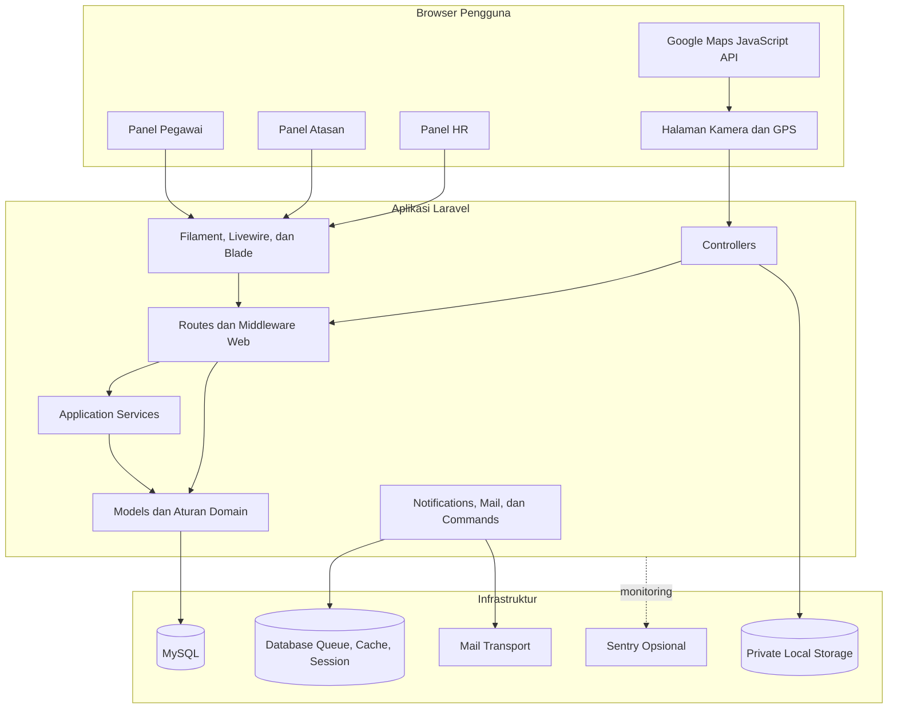

## 2.2 Metode Pengembangan Sistem

Pengembangan mengikuti pola iteratif Rapid Application Development (RAD). Metode ini sesuai untuk aplikasi yang banyak bergantung pada alur kerja dan antarmuka pengguna karena kebutuhan dapat divalidasi melalui implementasi kecil, pengujian, lalu perbaikan berulang.

> Gambar 2.2 — Siklus metode Rapid Application Development (RAD)

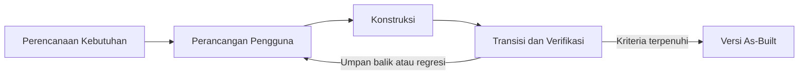

### 2.2.1 Perencanaan Kebutuhan

Tahap perencanaan memetakan masalah utama, aktor, data, aturan bisnis, dan batas sistem. Hasil tahap ini mencakup:

1. identifikasi tiga peran pengguna;
2. pemetaan proses organisasi, dinas, absensi, merit, kompetensi, pelatihan, mentoring, dan laporan;
3. penentuan data sensitif seperti kata sandi, koordinat, foto, nilai, dan catatan penilaian;
4. identifikasi kebutuhan transaksi dan penguncian data pada proses yang dapat dijalankan bersamaan;
5. penetapan batas as-built agar fitur yang belum ada tidak dilaporkan sebagai implementasi.

### 2.2.2 Perancangan Pengguna

Tahap ini menerjemahkan kebutuhan menjadi panel, resource, form, tabel, widget, serta halaman khusus. Setiap peran memperoleh navigasi dan scope data berbeda. Alur yang melibatkan lebih dari satu aktor dimodelkan sebagai perubahan status, misalnya persetujuan pelatihan dan publikasi merit.

Rancangan juga mempertimbangkan perangkat bergerak untuk halaman absensi. Tombol pengambilan kamera dan GPS dibuat sebagai langkah eksplisit agar pengguna mengetahui data apa yang sedang diambil. Pesan validasi ditampilkan dalam bahasa Indonesia.

### 2.2.3 Konstruksi

Konstruksi dilakukan secara modular dengan urutan umum:

1. migration dan model data;
2. enum status dan aturan domain;
3. service untuk logika lintas model;
4. panel Filament, controller, Blade, dan JavaScript;
5. notifikasi, laporan, command, scheduler, dan backup;
6. feature test untuk alur utama dan kondisi gagal.

Perubahan dibangun mengikuti pola Laravel dan komponen yang sudah tersedia. Tidak digunakan arsitektur terdistribusi, autentikasi token, atau dependency frontend tambahan ketika kemampuan native browser dan framework sudah mencukupi.

### 2.2.4 Transisi dan Verifikasi

Tahap transisi memastikan implementasi dapat dijalankan pada lingkungan lokal dan perilaku utama sesuai kebutuhan. Verifikasi meliputi:

- migration dan seeding data awal;
- pengujian otomatis pada SQLite in-memory;
- pemeriksaan hak akses setiap panel dan record;
- pengujian alur lintas modul;
- pemeriksaan ekspor dan akses foto privat;
- format kode dengan Laravel Pint;
- pemeriksaan perubahan Git;
- pengujian manual browser dan perangkat untuk kamera, GPS, responsive layout, serta integrasi Google Maps.

### 2.2.5 Jadwal Tahapan Pengembangan

Tahapan pengembangan dilaksanakan secara iteratif dengan durasi yang dapat disesuaikan kebutuhan operasional. Jadwal berikut menjadi acuan dokumentasi.

| Tahap | Kegiatan utama | Deliverable |
| --- | --- | --- |
| Perencanaan kebutuhan | Pemetaan peran, proses, data sensitif, batas as-built | Daftar kebutuhan fungsional dan nonfungsional |
| Perancangan pengguna | Rancangan panel, resource, form, alur status | Prototipe antarmuka dan diagram alur |
| Konstruksi | Migration, model, service, panel, laporan, test | Implementasi modul pada lingkungan lokal |
| Transisi dan verifikasi | Testing otomatis, hak akses, ekspor, pengujian manual | Hasil uji, dokumentasi as-built, laporan akhir |

Setiap iterasi bekerja pada modul dengan prioritas: organisasi dan autentikasi, dinas dan absensi, KPI dan merit, kemudian kompetensi, pelatihan, dan mentoring. Perubahan pada satu modul diuji kembali bersama suite untuk memastikan tidak terjadi regresi pada modul lain.

## 2.3 Perangkat dan Teknologi Pengembangan

### 2.3.1 Bahasa dan Framework Backend

| Komponen | Implementasi aktif | Peran |
| --- | --- | --- |
| PHP | Requirement `^8.2` | Bahasa backend |
| Laravel | `12.64.0` | Framework aplikasi, autentikasi, validasi, ORM, queue, mail, scheduler |
| Filament | `5.6.8` | Panel, resource, form, table, widget, dan action |
| Livewire | `4.3.3` | Interaksi reaktif pada panel Filament |
| Blade | Bawaan Laravel | Template login, absensi, laporan, dan email |

### 2.3.2 Teknologi Frontend

| Komponen | Implementasi aktif | Peran |
| --- | --- | --- |
| Tailwind CSS | `4.3.2` | Styling aplikasi |
| Vite | `7.3.6` | Build aset frontend |
| Vanilla JavaScript | Native browser | Kamera, geolocation, watermark, dan submit absensi |
| Alpine.js | Disediakan ekosistem Filament | Interaksi ringan antarmuka |
| Axios | `1.18.1` | Dependency frontend tersedia pada proyek |

### 2.3.3 Basis Data dan Penyimpanan

MySQL merupakan basis data default aplikasi. Konfigurasi container lokal memakai image MySQL 8.4.10. PHPUnit memakai SQLite in-memory agar test cepat dan terisolasi. Session, cache, queue, dan notification menggunakan driver basis data. Foto absensi disimpan pada disk `local` dan tidak dipublikasikan langsung dari direktori web.

Penggunaan driver basis data untuk session, cache, dan queue menyederhanakan deployment karena tidak memerlukan proses eksternal tambahan seperti Redis atau memcached. Penyimpanan foto pada disk privat, bukan direktori web publik, menjadi lapisan awal perlindungan data sensitif sebelum pemeriksaan otorisasi pada endpoint foto.

### 2.3.4 Peta, Lokasi, dan Kamera

Google Maps JavaScript API dan Places digunakan untuk pencarian serta pemilihan lokasi dinas. Browser Geolocation API membaca koordinat dan akurasi perangkat. MediaDevices API membuka kamera. Canvas browser dipakai untuk menghasilkan foto ber-watermark sebelum file dikirim ke server.

Seluruh pengambilan data tersebut berjalan pada sisi klien tanpa modul backend tambahan. Watermark dibubuhkan pada browser agar konteks pegawai, waktu, dan koordinat selalu menyatu dengan bukti visual, sehingga berkas yang tersimpan di server langsung siap ditelaah tanpa proses pengolahan lanjutan.

### 2.3.5 Laporan dan Ekspor

Laporan dapat ditampilkan pada halaman web dan diekspor menggunakan:

- `league/csv` untuk CSV;
- OpenSpout `4.32.0` untuk XLSX;
- `barryvdh/laravel-dompdf` `3.1.2` untuk PDF.

CSV dan XLSX dikirim sebagai streamed response agar berkas besar tidak memberatkan memori. Nilai teks yang dapat dibaca spreadsheet sebagai formula dinetralkan dengan karakter pelindung sebelum ekspor untuk mencegah formula injection ketika berkas dibuka pada aplikasi spreadsheet.

### 2.3.6 Operasional dan Pengujian

| Komponen | Implementasi aktif | Peran |
| --- | --- | --- |
| PHPUnit | `11.5.56` | Unit dan feature test |
| Laravel Pint | `1.29.3` | Format kode PHP |
| GitHub Actions | Workflow proyek | Continuous integration |
| Sentry Laravel SDK | `4.27.0` | Monitoring bila DSN dikonfigurasi |
| Laravel Scheduler | Bawaan framework | Kalkulasi, pengingat, laporan, dan backup terjadwal |

---

# BAB III

# TINJAUAN PUSTAKA

## 3.1 Kajian Sistem Sejenis

### 3.1.1 Sistem Absensi Berbasis GPS

Sistem absensi berbasis GPS umumnya menggunakan koordinat perangkat untuk menentukan kedekatan pengguna dengan titik kerja. Pola yang lazim adalah menyimpan koordinat lokasi, menetapkan radius, mengambil posisi perangkat, kemudian menghitung jarak antara dua titik. Pendekatan ini lebih kuat daripada pencatatan waktu saja karena menyediakan konteks lokasi.

Namun, koordinat GPS tidak selalu presisi. Hambatan bangunan, kualitas sensor, izin browser, dan kondisi jaringan dapat menghasilkan akurasi yang buruk. Sistem yang baik tidak cukup memeriksa apakah koordinat berada di dalam radius; nilai akurasi dan konsistensi waktu juga perlu dicatat agar data meragukan dapat diperiksa manusia.

Sistem SDM menerapkan pola tersebut pada absensi perjalanan dinas. Sistem menggabungkan koordinat, akurasi, jarak, waktu, jadwal penugasan, dan foto kamera. Data yang berada di luar radius, memiliki akurasi buruk, atau menunjukkan perbedaan waktu di luar toleransi ditandai **Memerlukan Pemeriksaan**. Sistem SDM tidak melakukan pengenalan wajah dan tidak menganggap foto sebagai bukti biometrik.

### 3.1.2 Sistem Informasi SDM Terintegrasi

Sistem informasi SDM menggabungkan data organisasi, pegawai, operasional, penilaian, dan pengembangan. Nilai utama integrasi bukan sekadar menempatkan semua menu dalam satu aplikasi, tetapi menjaga hubungan data dan aturan proses. Contohnya, perintah dinas harus dibuat oleh Atasan bagi bawahan langsung, hasil merit harus memakai periode yang sama dengan KPI, dan rekomendasi pelatihan harus merujuk pegawai serta hasil merit yang sesuai.

Sistem SDM memakai satu model `User` untuk semua peran. Hubungan Atasan–Pegawai disimpan melalui `manager_id`, sedangkan unit dan jabatan menjadi referensi struktur organisasi. Pola ini mengurangi duplikasi identitas antarmodul dan memungkinkan scope data yang konsisten.

### 3.1.3 Sistem Penilaian Kinerja dan Merit

Penilaian berbasis merit menggabungkan ukuran kuantitatif dan evaluasi perilaku. KPI merepresentasikan target serta capaian, data kepatuhan menggambarkan pelaksanaan tugas, dan penilaian manusia memberi konteks yang tidak selalu dapat dihitung otomatis. Agar hasil dapat dipertanggungjawabkan, formula, bobot, sumber data, waktu perhitungan, serta tahap verifikasi harus tersimpan.

Sistem SDM menyimpan bobot komponen per periode dan mewajibkan totalnya 100%. Hasil merit merupakan snapshot sehingga nilai yang telah diverifikasi atau dipublikasikan tidak berubah akibat perubahan data berikutnya. Publikasi dilakukan setelah verifikasi Atasan dan HR serta setelah periode berakhir.

### 3.1.4 Sistem Pembinaan Karier

Pembinaan karier berbasis kompetensi membandingkan kemampuan aktual pegawai dengan standar jabatan tujuan. Selisih level menjadi dasar rekomendasi pengembangan. Pelatihan cocok ketika tersedia materi yang berhubungan dengan kompetensi yang kurang, sedangkan mentoring dapat dipakai ketika tidak tersedia pelatihan yang sesuai atau ketika pengembangan membutuhkan pendampingan langsung.

Sistem SDM menghubungkan kamus kompetensi, standar kompetensi jabatan, kompetensi pegawai, target jabatan, katalog pelatihan, pengajuan pelatihan, dan mentoring. Sistem menghasilkan analisis gap; keputusan akhir tetap berada pada Pegawai, Atasan, dan HR melalui workflow yang tercatat.

### 3.1.5 Posisi Sistem SDM

| Aspek | Sistem sederhana | Implementasi Sistem SDM saat ini |
| --- | --- | --- |
| Absensi | Waktu atau koordinat saja | Jadwal dinas, GPS, akurasi, radius, waktu, foto, watermark, pemeriksaan HR |
| Struktur pengguna | Akun tanpa relasi organisasi | Unit, jabatan, peran, Atasan langsung, dan scope data |
| Penilaian | Nilai tunggal | KPI, kepatuhan dinas, penilaian Atasan, umpan balik rekan, bobot periode |
| Publikasi hasil | Langsung terlihat | Verifikasi Atasan dan HR, lalu publikasi setelah periode berakhir |
| Karier | Daftar pelatihan | Target jabatan, gap kompetensi, rekomendasi pelatihan/mentoring |
| Pelaporan | Rekap satu modul | Ringkasan lintas absensi, merit, pelatihan, mentoring; CSV/XLSX/PDF |
| Audit | Riwayat terbatas | Activity log untuk perubahan dan transisi penting |

## 3.2 Landasan Teori

### 3.2.1 Modular Monolith

Modular monolith adalah aplikasi yang dirilis sebagai satu unit tetapi dibagi menjadi modul dengan tanggung jawab jelas. Berbeda dari microservices atau SOA terdistribusi, komunikasi antarmodul terjadi melalui pemanggilan kode dalam proses yang sama dan umumnya memakai basis data yang sama.

Keuntungan pendekatan ini adalah konsistensi transaksi, deployment sederhana, debugging lebih langsung, dan overhead infrastruktur rendah. Risikonya adalah batas modul dapat kabur bila logika bisnis tersebar. Sistem SDM mengurangi risiko tersebut melalui pemisahan controller, model, service, resource Filament, notification, dan command.

### 3.2.2 Application Service

Application service mengoordinasikan satu use case yang dapat melibatkan beberapa model atau sumber daya. Service tidak harus menjadi layanan jaringan. Pada Sistem SDM, `AttendanceRecorder` mengoordinasikan penugasan, idempotensi, jarak, status, log, dan notifikasi. `MeritCalculator` mengoordinasikan KPI, absensi, penilaian, formula, hasil, dan notifikasi. Pendekatan ini menjaga controller tetap fokus pada HTTP dan tampilan.

Pemisahan tersebut membuat aturan bisnis dapat diuji secara langsung tanpa melalui antarmuka web. Apabila kebijakan berubah, perbaikan cukup dilakukan pada satu service sehingga risiko ketidakkonsistenan logika antarmodul dapat ditekan.

### 3.2.3 Role-Based Access Control dan Record Scope

Role-Based Access Control (RBAC) membatasi kemampuan berdasarkan peran. Dalam aplikasi bisnis, pembatasan menu saja tidak cukup. Query dan aksi pada record juga perlu dibatasi. Sistem SDM menerapkan dua tingkat kontrol:

1. akses panel sesuai enum peran dan status akun aktif;
2. scope record berdasarkan kepemilikan atau hubungan organisasi.

Pegawai hanya melihat data sendiri, Atasan melihat data bawahan langsung atau record yang dikelolanya, sedangkan HR melihat data organisasi sesuai tanggung jawab administrasi.

### 3.2.4 Framework Laravel dan Filament

Laravel menyediakan routing, middleware, autentikasi session, validasi, Eloquent ORM, migration, transaction, queue, notification, mail, scheduler, storage, dan testing. Filament membangun panel administrasi di atas Laravel dan Livewire melalui resource, page, form, table, widget, action, serta notification UI.

Pada Sistem SDM, kombinasi tersebut memungkinkan sebagian besar antarmuka memakai komponen deklaratif. Halaman absensi tetap dibuat khusus dengan Blade dan JavaScript karena membutuhkan kamera, geolocation, canvas watermark, dan pengiriman berkas.

### 3.2.5 Geofencing dan Rumus Haversine

Geofencing menentukan apakah suatu posisi berada dalam wilayah yang ditetapkan. Sistem SDM memakai geofence berbentuk lingkaran yang terdiri atas titik pusat dan radius dalam meter. Jarak permukaan bumi dihitung menggunakan rumus Haversine. Rumus dihitung bertahap dengan tiga langkah berikut.

**Langkah 1 — menghitung nilai `a`.**

`a = (sin(Δφ/2))² + cos(φ₁) × cos(φ₂) × (sin(Δλ/2))²`

Keterangan:
- `Δφ` adalah selisih lintang kedua titik dalam radian;
- `Δλ` adalah selisih bujur kedua titik dalam radian;
- `φ₁` adalah lintang titik pertama dalam radian;
- `φ₂` adalah lintang titik kedua dalam radian;
- fungsi `sin` dan `cos` adalah fungsi trigonometri sinus dan kosinus.

**Langkah 2 — menghitung nilai `c`.**

`c = 2 × arctan2(√a, √(1 − a))`

Keterangan:
- `√a` adalah akar kuadrat dari `a`;
- `arctan2` adalah fungsi arctangen dua argumen;
- hasil `c` merupakan sudut sentral antara dua titik dalam radian.

**Langkah 3 — menghitung jarak `d` dalam meter.**

`d = R × c`

Keterangan:
- `R` adalah jari-jari rata-rata bumi, yaitu 6.371.000 meter;
- hasil `d` adalah jarak antara dua titik dalam meter.

Hasil `d` kemudian dibandingkan dengan radius snapshot pada perintah dinas untuk menentukan apakah pegawai berada di dalam wilayah tugas.

### 3.2.6 Akurasi GPS dan Pemeriksaan Manual

Geolocation browser mengembalikan estimasi akurasi dalam meter. Angka yang besar menunjukkan posisi kurang pasti. Oleh karena itu, keputusan tidak hanya bergantung pada jarak. Sistem SDM memberi status pemeriksaan jika akurasi tidak tersedia atau melewati batas konfigurasi. Pola ini mempertahankan data untuk audit tanpa otomatis menerima informasi yang kualitasnya rendah.

Dengan demikian, data yang meragukan tidak langsung dibuang melainkan disimpan bersama alasan pemeriksaan. Pendekatan ini memungkinkan HR mempertimbangkan konteks sebelum menetapkan status final, sekaligus menjaga objektivitas proses.

### 3.2.7 Idempotensi dan Transaksi Basis Data

Idempotensi memastikan pengulangan request yang sama tidak membuat record ganda. Saat absensi dikirim, sistem mengunci perintah dinas dan mencari absensi pada tanggal yang sama. Jika record sudah ada, record tersebut dikembalikan dan foto baru dihapus.

Transaksi basis data memastikan perubahan yang saling bergantung berhasil atau gagal sebagai satu kesatuan. `lockForUpdate` digunakan pada alur absensi, merit, pelatihan, dan mentoring untuk mengurangi race condition ketika dua proses mencoba mengubah record yang sama.

### 3.2.8 Penilaian KPI dan Merit

Skor KPI dihitung dari rasio capaian terhadap target untuk setiap indikator. Rasio tiap indikator dibatasi maksimum 120% agar capaian berlebih tetap dihargai tanpa mendominasi total nilai. Skor setiap indikator kemudian dibobotkan.

Skor kepatuhan dinas dihitung dari perbandingan tanggal dinas selesai yang memiliki absensi valid terhadap seluruh tanggal dinas selesai dalam periode. Bila tidak ada dinas selesai, nilai kepatuhan ditetapkan 100. Penilaian Atasan dan umpan balik rekan pada skala 1–5 dinormalisasi menjadi skala 0–100.

### 3.2.9 Analisis Kesenjangan Kompetensi

Analisis gap membandingkan `required_level` pada standar jabatan dengan level aktual pegawai. Nilai selisih positif menunjukkan kebutuhan pengembangan. Sistem mencari pelatihan aktif yang terhubung dengan kompetensi tersebut. Bila tidak ada pelatihan yang sesuai, mentoring menjadi rekomendasi alternatif.

Logika pemilihan rekomendasi tersebut menjadikan pengembangan karier berbasis data. Setiap rekomendasi dapat ditelusuri kembali ke kompetensi yang kurang, sehingga keputusan pelatihan atau mentoring tidak lagi bergantung pada asumsi subjektif semata.

### 3.2.10 Workflow dan State Transition

Workflow membatasi perubahan status berdasarkan keadaan record dan aktor. Contoh alur pelatihan adalah `Menunggu Atasan` → `Menunggu HR` → `Disetujui` → `Selesai`, dengan jalur penolakan dan pengajuan ulang. Setiap transisi memeriksa peran, kepemilikan, status awal, dan aturan waktu.

Pembatasan tersebut memberi jejak audit pada setiap perubahan tahap dan mencegah transisi yang tidak sah. Ketika dua pengguna mencoba mengubah record dalam waktu bersamaan, hubungan transisi dan penguncian memastikan hanya satu hasil yang berlaku dan dicatat.

### 3.2.11 Notifikasi, Queue, dan Scheduler

Notifikasi database menyediakan informasi di dalam panel dan dipolling berkala. Email digunakan pada kejadian tertentu, seperti penugasan dinas, publikasi merit, dan absensi yang memerlukan pemeriksaan. Queue database memindahkan pekerjaan yang sesuai dari request utama. Scheduler menjalankan command berkala untuk kalkulasi, pengingat, laporan, dan backup sesuai konfigurasi aplikasi.

Kombinasi ketiganya memisahkan pekerjaan berat dari permintaan interaktif sehingga antarmuka tetap responsif. Scheduler memastikan proses periodik, seperti kalkulasi merit dan pengingat KPI, berjalan tanpa campur tangan manual setiap siklus.

### 3.2.12 Pengujian Kotak Hitam dan Integrasi

Pengujian kotak hitam memeriksa hubungan input, aksi, dan output tanpa bergantung pada detail internal. Pada Sistem SDM, pengujian otomatis menggunakan Laravel feature test untuk menguji route, model, service, database, serta komponen Livewire. Pengujian integrasi diperlukan karena banyak aturan melibatkan hubungan aktor, status, waktu, dan beberapa tabel sekaligus.

Cakupan tersebut menempatkan aturan bisnis yang paling rawan — absensi, merit, pelatihan, dan mentoring — di bawah perlindungan yang dapat dijalankan ulang secara berkala. Setiap perubahan kode dapat diuji kembali dengan cepat untuk mendeteksi regresi pada alur lama.

## 3.3 Definisi Istilah Penting

| Istilah | Definisi dalam konteks laporan |
| --- | --- |
| Abu berjalan (dinas) | Penugasan di luar kantor yang ditetapkan melalui perintah dinas oleh Atasan |
| Absensi valid | Kehadiran dinas yang memenuhi radius, akurasi GPS, dan toleransi waktu |
| Aplikasi layanan (application service) | Kelas yang mengoordinasikan satu use case yang melibatkan beberapa model |
| As-built | Keadaan implementasi yang benar-benar berjalan pada build aktif |
| Atasan | Pengguna berperan Manager yang mengelola bawahan langsung |
| Biometrik | Pengenalan identitas wajah/jari; tidak digunakan pada sistem |
| Geofencing | Batas wilayah berbentuk lingkaran dari titik pusat dan radius |
| Rumus Haversine | Formula jarak dua titik di permukaan bumi |
| Idempotensi | Pengulangan request yang sama tidak membuat data ganda |
| Kepatuhan dinas | Perbandingan tanggal dinas selesai yang memiliki absensi valid |
| KPI | Key Performance Indicator, target dan capaian terukur pegawai |
| Memerlukan Pemeriksaan | Status absensi yang datanya meragukan dan perlu penilaian HR |
| Merit | Sistem penilaian kinerja dari empat komponen berbobot per periode |
| Modular monolith | Satu aplikasi yang dibagi modul bertanggung jawab jelas |
| Panel | Antarmuka Filament khusus peran (Pegawai, Atasan, HR) |
| RAD | Rapid Application Development, metode pengembangan iteratif |
| RBAC | Role-Based Access Control, kontrol akses berbasis peran |
| Record scope | Pembatasan query dan aksi berdasarkan kepemilikan/hubungan |
| Scheduler | Penjadwal command berkala di Laravel |
| Snapshot | Salinan nilai yang menjadi dasar hasil agar tidak berubah |
| Workflow | Aturan perubahan status yang dibatasi aktor dan kondisi |

---

# BAB IV

# ANALISIS DAN PERANCANGAN SISTEM

## 4.1 Analisis Kebutuhan Sistem

### 4.1.1 Aktor Sistem

| Aktor | Tanggung jawab utama |
| --- | --- |
| Pegawai | Melihat tugas dan data pribadi, melakukan absensi dinas, melihat/mengisi KPI sesuai hak, mengirim umpan balik, memilih target karier, mengajukan pelatihan dan mentoring |
| Atasan | Mengelola dinas bawahan langsung, memantau absensi, mengelola KPI bawahan, memberi penilaian, memverifikasi merit, memproses pelatihan dan mentoring |
| Admin SDM/HR | Mengelola organisasi dan master data, memeriksa absensi, mengatur periode merit, memverifikasi/publikasi hasil, mengelola kompetensi dan pelatihan, melihat laporan serta audit |

Semua aktor menggunakan halaman login yang sama. Setelah autentikasi berhasil, sistem mengarahkan pengguna ke panel yang sesuai dengan perannya. Akun tidak aktif tidak dapat mengakses panel.

### 4.1.2 Kebutuhan Fungsional

| Kode | Kebutuhan fungsional | Aktor |
| --- | --- | --- |
| FR-AUT-01 | Sistem menyediakan login dan logout berbasis session | Semua |
| FR-AUT-02 | Sistem mengarahkan pengguna ke panel sesuai peran | Semua |
| FR-AUT-03 | Sistem menolak akun tidak aktif dan akses ke panel peran lain | Semua |
| FR-ORG-01 | HR mengelola unit, jabatan, akun, dan status aktif | HR |
| FR-ORG-02 | Sistem memastikan jabatan berasal dari unit pengguna | HR |
| FR-ORG-03 | Pegawai aktif wajib memiliki Atasan aktif | HR |
| FR-ORG-04 | Atasan yang masih mempunyai bawahan tidak dapat dinonaktifkan atau diubah menjadi peran lain | HR |
| FR-DIN-01 | HR mengelola lokasi dinas dan radius geofence | HR |
| FR-DIN-02 | Atasan membuat dinas hanya untuk bawahan langsung | Atasan |
| FR-DIN-03 | Lokasi dinas dapat dipilih melalui Google Maps dan disalin sebagai snapshot ke perintah dinas | Atasan |
| FR-DIN-04 | Atasan dapat mengubah atau membatalkan dinas hanya ketika aturan waktu dan status terpenuhi | Atasan |
| FR-DIN-05 | Pegawai, Atasan, dan HR melihat dinas sesuai scope masing-masing | Semua |
| FR-ABS-01 | Pegawai mengambil foto langsung melalui kamera browser | Pegawai |
| FR-ABS-02 | Halaman membaca koordinat, akurasi, dan waktu perangkat | Pegawai |
| FR-ABS-03 | Sistem menambahkan watermark pada bukti foto sebelum dikirim | Pegawai |
| FR-ABS-04 | Sistem menghitung jarak ke lokasi tugas dengan rumus Haversine | Sistem |
| FR-ABS-05 | Sistem menentukan status Valid, Terlambat, atau Memerlukan Pemeriksaan | Sistem |
| FR-ABS-06 | Pengiriman ulang pada dinas dan tanggal yang sama tidak membuat duplikat | Sistem |
| FR-ABS-07 | HR dapat memverifikasi absensi yang memerlukan pemeriksaan | HR |
| FR-ABS-08 | Foto hanya dapat dibuka oleh Pegawai pemilik, Atasan penugas, atau HR | Semua |
| FR-MER-01 | HR mengelola periode dan bobot komponen yang totalnya 100% | HR |
| FR-MER-02 | HR mengelola indikator KPI; total bobot indikator per periode wajib 100% sebelum kalkulasi | HR |
| FR-MER-03 | KPI dicatat untuk Pegawai dan Atasan yang mempunyai hubungan langsung | Pegawai/Atasan/HR |
| FR-MER-04 | Sistem menerima penilaian Atasan→Pegawai, Pegawai→Atasan, dan Rekan→Pegawai sesuai hubungan yang valid | Pegawai/Atasan |
| FR-MER-05 | Sistem menghitung skor KPI, kepatuhan dinas, penilaian Atasan, umpan balik rekan, total, dan simulasi bonus | Sistem/HR |
| FR-MER-06 | Hasil harus diverifikasi Atasan lalu HR sebelum dipublikasikan | Atasan/HR |
| FR-MER-07 | Hasil dan input periode terkunci setelah publikasi | Sistem |
| FR-KAR-01 | HR mengelola kamus kompetensi dan standar jabatan pada level 1–5 | HR |
| FR-KAR-02 | HR mencatat kompetensi Pegawai; akses baca mengikuti scope peran | HR/Semua |
| FR-KAR-03 | Pegawai memilih satu jabatan tujuan yang lebih tinggi | Pegawai |
| FR-KAR-04 | Sistem menghitung gap dan memberi rekomendasi pelatihan atau mentoring | Sistem |
| FR-PEL-01 | HR mengelola katalog pelatihan dan kompetensi terkait | HR |
| FR-PEL-02 | Pegawai mengajukan pelatihan untuk dirinya sendiri | Pegawai |
| FR-PEL-03 | Atasan menyetujui/menolak pengajuan atau merekomendasikan pelatihan dari hasil merit | Atasan |
| FR-PEL-04 | HR memverifikasi, menolak, dan menyelesaikan pelatihan sesuai status/waktu | HR |
| FR-MEN-01 | Pegawai mengajukan mentoring kepada Atasan langsung | Pegawai |
| FR-MEN-02 | Atasan menyetujui, menolak, menjadwalkan, dan menyelesaikan mentoring | Atasan |
| FR-OPS-01 | Sistem mengirim notifikasi database dan email untuk kejadian yang didukung | Sistem |
| FR-OPS-02 | HR melihat laporan lintas modul dengan filter dan pilihan kolom | HR |
| FR-OPS-03 | HR mengekspor laporan ke CSV, XLSX, dan PDF | HR |
| FR-OPS-04 | Sistem mencatat aktivitas penting pada audit log | Sistem/HR |
| FR-OPS-05 | Command dan scheduler mendukung kalkulasi, pengingat, laporan, dan backup | HR/Sistem |

### 4.1.3 Kebutuhan Nonfungsional

| Kode | Kebutuhan nonfungsional | Rancangan pemenuhan |
| --- | --- | --- |
| NFR-SEC-01 | Autentikasi dan otorisasi | Session, panel gate, middleware akun aktif, scope query, pemeriksaan aktor pada model/service |
| NFR-SEC-02 | Perlindungan request | CSRF, validasi Laravel, rate limit login dan submit absensi |
| NFR-SEC-03 | Perlindungan data sensitif | Password hashed; foto pada private local disk; akses foto diperiksa per request |
| NFR-DAT-01 | Konsistensi data | Foreign key, unique constraint, transaction, `lockForUpdate`, dan validasi domain |
| NFR-DAT-02 | Pencegahan duplikat | Idempotensi aplikasi dan unique constraint absensi per dinas/tanggal |
| NFR-USA-01 | Kemudahan penggunaan | Label serta pesan Indonesia, navigasi berdasarkan tugas peran, form responsif |
| NFR-USA-02 | Dukungan perangkat bergerak | Halaman absensi responsif dengan kamera dan geolocation browser |
| NFR-MNT-01 | Kemudahan pemeliharaan | Struktur Laravel, service class, enum status, shared resource Filament |
| NFR-OBS-01 | Keterlacakan | Activity log, database notification, mail log lokal, dan Sentry opsional |
| NFR-TST-01 | Kemampuan diuji | Factory, seeder idempoten, SQLite in-memory, unit dan feature test |
| NFR-EXP-01 | Keamanan ekspor | Scope HR, filter tervalidasi, dan netralisasi formula spreadsheet |

### 4.1.4 Pemetaan Kebutuhan terhadap Tujuan Khusus

Setiap kebutuhan fungsional ditelusuri ke tujuan khusus proyek agar cakupan sistem dapat dipertanggungjawabkan. Kelompok `ORG` dan `AUT` mendukung tujuan 1–2; kelompok `DIN` dan `ABS` mendukung tujuan 3–5; kelompok `MER` mendukung tujuan 6–8 dan 12; kelompok `KAR`, `PEL`, dan `MEN` mendukung tujuan 9–10; kelompok `OPS` mendukung tujuan 11.

| Tujuan khusus | Kebutuhan fungsional terkait |
| --- | --- |
| 1. Autentikasi terpusat dan panel per peran | FR-AUT-01 s.d. FR-AUT-03 |
| 2. Unit, jabatan, akun, relasi Atasan–Pegawai | FR-ORG-01 s.d. FR-ORG-04 |
| 3. Pembuatan dan pemantauan perintah dinas | FR-DIN-01 s.d. FR-DIN-05 |
| 4. Pencatatan absensi GPS, foto, watermark, validasi radius | FR-ABS-01 s.d. FR-ABS-06 |
| 5. Pemeriksaan HR untuk absensi meragukan | FR-ABS-07, FR-ABS-08 |
| 6. Periode, indikator KPI, capaian, penilaian, hasil merit | FR-MER-01 s.d. FR-MER-04 |
| 7. Verifikasi merit oleh Atasan dan HR sebelum publikasi | FR-MER-06, FR-MER-07 |
| 8. Simulasi bonus tanpa memproses pembayaran | FR-MER-05 |
| 9. Analisis kesenjangan kompetensi terhadap jabatan tujuan | FR-KAR-01 s.d. FR-KAR-04 |
| 10. Alur pengajuan, persetujuan, dan penyelesaian pelatihan/mentoring | FR-PEL-01 s.d. FR-PEL-04, FR-MEN-01, FR-MEN-02 |
| 11. Laporan, ekspor, notifikasi, audit, scheduler, backup | FR-OPS-01 s.d. FR-OPS-05 |
| 12. Perlindungan aturan bisnis oleh validasi, transaksi, dan pengujian | FR-MER-05, FR-OPS-04, NFR-SEC-01 s.d. NFR-SEC-03, NFR-DAT-01, NFR-DAT-02 |

## 4.2 Perancangan Arsitektur Sistem

### 4.2.1 Pembagian Lapisan

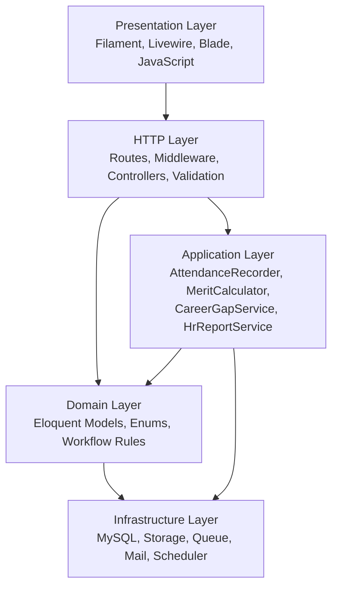

Lapisan tersebut merupakan pembagian tanggung jawab di dalam satu aplikasi. Tidak ada komunikasi HTTP antarlayanan internal. Model tetap memuat invariant yang harus berlaku dari semua entry point, sedangkan service menangani use case yang menggabungkan beberapa model.

Urutan siklus dimulai dari **presentation layer** yang menyajikan antarmuka Filament dan Livewire serta menerjemahkan aksi pengguna menjadi request. Lapisan HTTP memotong lalu lintas melalui route, middleware, dan controller untuk memeriksa autentikasi, otorisasi peran, validasi input, serta pembatasan record scope. Lapisan aplikasi menampung service yang mengorkestrasi use case seperti pencatatan absensi, perhitungan merit, dan analisis kesenjangan kompetensi; service ini yang memutuskan urutan pemanggilan model, transaksi, dan notifikasi, sehingga controller tetap ramping. Lapisan domain berisi model Eloquent beserta enum dan aturan status yang menjaga invariant bisnis. Lapisan infrastruktur menyediakan fasilitas penyimpanan, penyimpanan file, antrean, surel, dan penjadwalan yang dipakai lapisan di atasnya.

### 4.2.2 Siklus Request

1. Browser mengirim request melalui route `web`.
2. Middleware memeriksa session, status akun, CSRF, dan rate limit bila berlaku.
3. Filament page atau controller memeriksa hak akses dan memvalidasi input.
4. Application service atau model menjalankan aturan bisnis.
5. Perubahan persisten dijalankan dalam transaksi bila melibatkan state penting.
6. Activity log dan notifikasi dibuat sesuai kejadian.
7. Respons dikembalikan sebagai HTML, stream file, atau JSON untuk halaman absensi.

## 4.3 Pemodelan Sistem

### 4.3.1 Diagram Use Case

Mermaid belum mempunyai notasi use case UML khusus. Diagram berikut memakai flowchart untuk menunjukkan hubungan aktor dan kelompok fungsi.

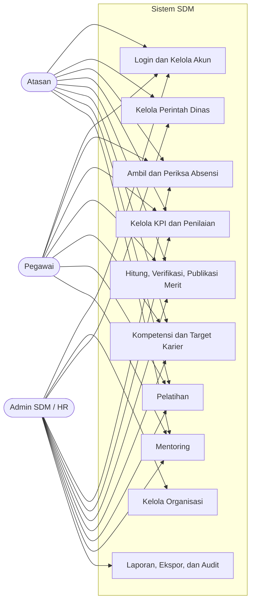

### 4.3.2 Diagram Aktivitas Absensi Dinas

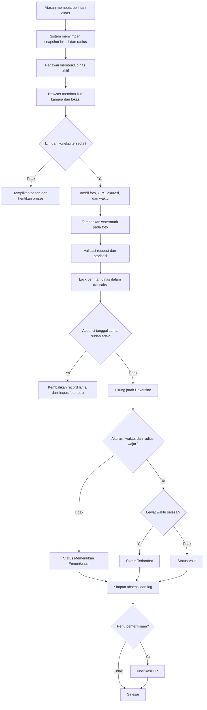

### 4.3.3 Diagram Aktivitas Sistem Merit

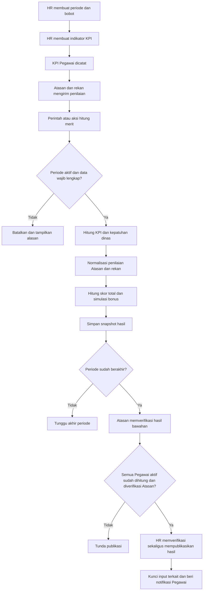

### 4.3.4 Diagram Aktivitas Pembinaan Karier

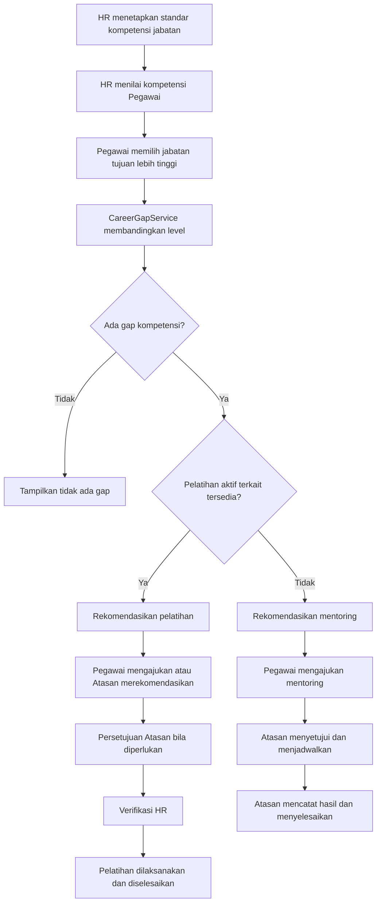

### 4.3.5 Diagram Urutan Absensi Dinas

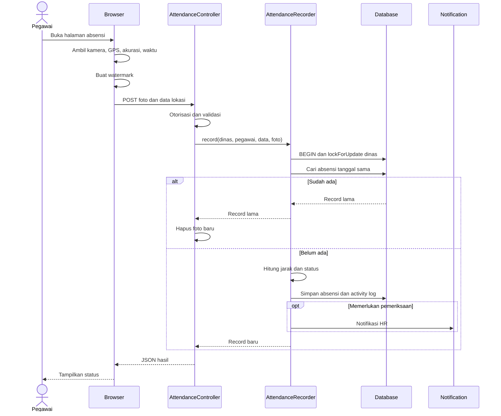

### 4.3.6 Diagram Urutan Perhitungan Merit

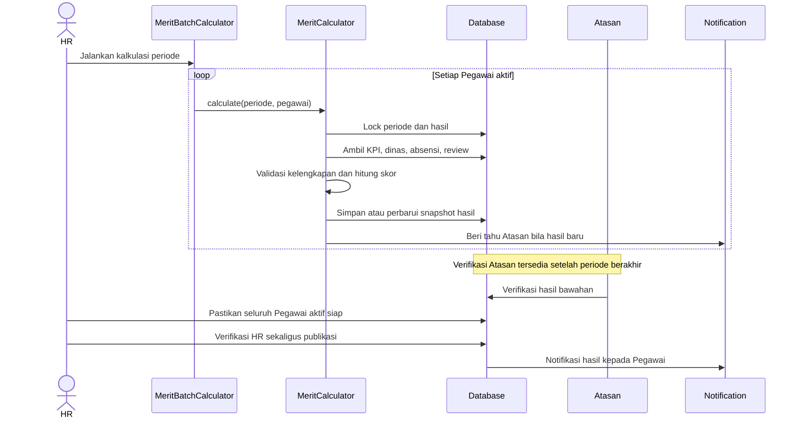

### 4.3.7 Diagram Urutan Pembinaan Karier

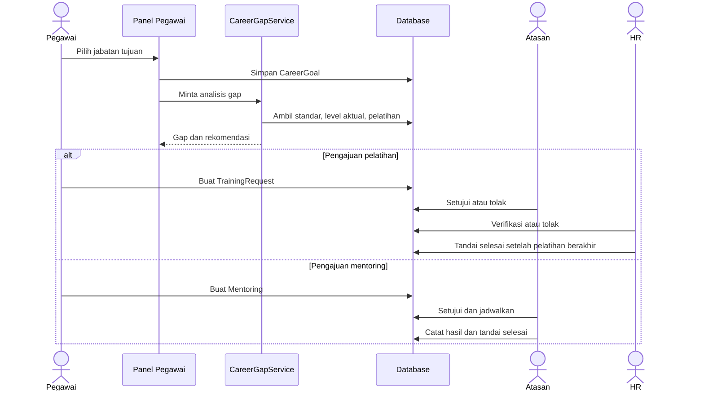

### 4.3.8 Diagram Kelas Inti

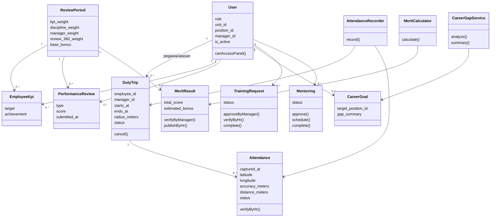

### 4.3.9 Entity Relationship Diagram

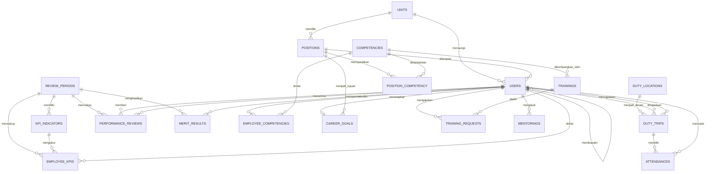

Tabel operasional tambahan meliputi `activity_logs`, `notifications`, `approval_chains`, tabel queue, cache, dan session Laravel. Relasi audit bersifat polymorphic sehingga tidak ditampilkan sebagai foreign key tunggal pada diagram inti.

### 4.3.10 Rancangan Struktur Tabel Inti

Rancangan skema dirinci per kelompok tabel untuk memperjelas tipe data, kunci, dan aturan unik.

#### Tabel `users`

| Kolom | Tipe | Kunci | Keterangan |
| --- | --- | --- | --- |
| `id` | bigint | PK | Identitas |
| `unit_id` | bigint | FK → `units` | Unit pengguna |
| `position_id` | bigint | FK → `positions` | Jabatan pengguna |
| `manager_id` | bigint | FK → `users`, nullable | Atasan langsung |
| `role` | enum | — | `Employee`, `Manager`, `Hr` |
| `email`, `password` | varchar | — | Kredensial; password ter-hash |
| `is_active` | boolean | — | Status akun |

#### Tabel `duty_trips`

| Kolom | Tipe | Kunci | Keterangan |
| --- | --- | --- | --- |
| `id` | bigint | PK | Identitas |
| `employee_id` | bigint | FK → `users` | Pegawai yang ditugaskan |
| `manager_id` | bigint | FK → `users` | Atasan pembuat dinas |
| `starts_at`, `ends_at` | datetime | — | Jadwal dinas |
| `latitude`, `longitude` | decimal | — | Snapshot lokasi dinas |
| `radius_meters` | unsigned int | — | Radius geofence snapshot |
| `status` | enum | — | `Approved`, `Cancelled`, dst. |

#### Tabel `attendances`

| Kolom | Tipe | Kunci | Keterangan |
| --- | --- | --- | --- |
| `id` | bigint | PK | Identitas |
| `duty_trip_id` | bigint | FK → `duty_trips` | Dinas terkait |
| `employee_id` | bigint | FK → `users` | Pegawai pencatat |
| `attendance_date` | date | UNIQUE bersama `duty_trip_id` | Tanggal absensi (idempotensi) |
| `latitude`, `longitude` | decimal | — | Koordinat pengambilan |
| `accuracy_meters` | unsigned int, nullable | — | Akurasi GPS |
| `distance_meters` | decimal | — | Jarak Haversine ke titik dinas |
| `photo_path` | varchar | — | Lokasi foto pada private disk |
| `status` | enum | — | `Valid`, `Late`, `NeedsReview` |
| `review_reason` | text, nullable | — | Alasan memerlukan pemeriksaan |

#### Tabel `review_periods`, `kpi_indicators`, `employee_kpis`

| Kolom | Tipe | Kunci | Keterangan |
| --- | --- | --- | --- |
| `review_periods.starts_at`, `ends_at` | datetime | — | Rentang penilaian |
| `review_periods.*_weight` | unsigned int | — | Bobot KPI, kepatuhan, Atasan, rekan; total 100 |
| `review_periods.base_bonus` | decimal | — | Dasar simulasi bonus |
| `kpi_indicators.weight` | unsigned int | — | Bobot indikator; total 100 per periode |
| `employee_kpis.target`, `achievement` | decimal | UNIQUE (`review_period_id`, `employee_id`, `kpi_indicator_id`) | Target dan capaian |

#### Tabel `performance_reviews`, `merit_results`

| Kolom | Tipe | Kunci | Keterangan |
| --- | --- | --- | --- |
| `performance_reviews.type` | enum | — | `ManagerToEmployee`, `EmployeeToManager`, `Peer` |
| `performance_reviews.score` | tinyint | — | Skala 1–5 |
| `merit_results.total_score` | decimal | — | Skor total snapshot |
| `merit_results.estimated_bonus` | decimal | — | Simulasi bonus |
| `merit_results.manager_verified_at`, `hr_verified_at`, `published_at` | datetime, nullable | — | Bukti tahap verifikasi/publikasi |

#### Tabel pengembangan karier

| Kolom | Tipe | Kunci | Keterangan |
| --- | --- | --- | --- |
| `competencies.name`, `description` | varchar, text | — | Kamus kompetensi |
| `position_competency.required_level` | tinyint | UNIQUE jumlah jabatan+kop kompetensi | Level wajib jabatan |
| `employee_competencies.actual_level` | tinyint | — | Level aktual penilaian |
| `career_goals.target_position_id` | bigint | UNIQUE per pegawai | Jabatan tujuan |
| `training_requests.status` | enum | — | `Menunggu Atasan`, `Menunggu HR`, `Disetujui`, `Selesai` |
| `mentorings.status` | enum | — | Status persetujuan, jadwal, selesai |

## 4.4 Perancangan UI/UX

### 4.4.1 Halaman Login

Halaman login menjadi entry point tunggal. Form hanya meminta email dan kata sandi, memakai rate limit, menampilkan validasi Indonesia, serta mengarahkan pengguna ke panel berdasarkan peran.

Pemakaian satu halaman login menyederhanakan pemeliharaan dan memastikan seluruh pengguna melewati pemeriksaan yang sama. Setelah otentikasi berhasil, sistem menentukan tujuan panel berdasarkan peran sehingga pengguna tidak perlu memilih menu panel secara manual.

> [PLACEHOLDER GAMBAR 4.1 — Halaman login versi implementasi aktif]

### 4.4.2 Panel Pegawai

Panel Pegawai menekankan tugas yang harus dilakukan pengguna: dinas aktif dan status absensi, KPI, hasil merit terpublikasi, kompetensi, target karier, katalog dan pengajuan pelatihan, serta mentoring. Record dibatasi pada data milik Pegawai.

Pembatasan record menghindarkan pegawai melihat informasi pengguna lain dan menegaskan bahwa panel berfungsi sebagai alat bekerja, bukan pusat administrasi. Widget dinas aktif menampilkan penugasan yang membutuhkan tindakan agar pegawai segera melaksanakan absensi sesuai jadwal.

> [PLACEHOLDER GAMBAR 4.2 — Dashboard dan navigasi Panel Pegawai]

### 4.4.3 Panel Atasan

Panel Atasan menampilkan konteks bawahan langsung. Navigasi mencakup perintah dinas, riwayat absensi, KPI, penilaian, hasil merit, kompetensi dan target karier bawahan, pengajuan pelatihan, serta mentoring.

Seluruh tindakan Atasan dibatasi pada pegawai yang berada dalam struktur bawahannya. Pembatasan ini menjaga keabsahan keputusan penugasan dan penilaian, sekaligus mencegah Atasan mengelola pegawai di luar kewenangannya.

> [PLACEHOLDER GAMBAR 4.3 — Dashboard dan navigasi Panel Atasan]

### 4.4.4 Panel HR

Panel HR menyediakan data organisasi, monitoring operasional, konfigurasi merit, pengembangan karier, laporan, dan audit. Aksi ditampilkan sesuai state record agar pengguna tidak menjalankan transisi yang tidak sah.

Penyesuaian aksi terhadap status mengurangi kesalahan operasi dan melatih pengguna memahami urutan alur. Hak akses HR hanya dikenakan pada panel ini, sehingga aktivitas administrasi tidak tercampur dengan fungsi operasional Pegawai atau Atasan.

> [PLACEHOLDER GAMBAR 4.4 — Dashboard dan navigasi Panel HR]

### 4.4.5 Halaman Absensi Mobile

Halaman absensi dibuat terpisah dari form Filament agar interaksi kamera dan lokasi lebih jelas. Alur pengguna masih berurutan: pengguna memilih perintah dinas yang sedang berjalan, sistem membuka kamera untuk mengambil foto, browser mengambil koordinat melalui Geolocation API beserta nilai akurasi, lalu pengguna meninjau pratinjau foto, titik koordinat, dan jarak terhadap lokasi dinas sebelum menekan tombol kirim. Pada langkah tinjauan tersebut, pengguna memperoleh kesempatan membaca ulang data sebelum data dikirim, sehingga kesalahan pengambilan foto atau lokasi dapat diulang tanpa meninggalkan halaman.

Setelah tombol kirim ditekan, halaman meneruskan foto dan koordinat ke server; server menjalankan pemeriksaan radius geofencing, waktu perangkat versus waktu server, dan akurasi GPS, lalu menetapkan status `Valid`, `Terlambat`, atau `Memerlukan Pemeriksaan`. Respons langsung menampilkan status tersebut kepada pengguna. Saat perangkat tidak terhubung internet, pengiriman gagal; halaman menampilkan pesan agar pengguna menyambungkan internet dan mencoba kembali, karena pencatatan belum mendukung antrean luring sesuai batasan proyek pada bagian 1.6.

> [PLACEHOLDER GAMBAR 4.5 — Halaman pengambilan absensi pada perangkat bergerak]

---

# BAB V

# IMPLEMENTASI SISTEM

## 5.1 Struktur Implementasi

### 5.1.1 Struktur Aplikasi

Implementasi mengikuti struktur Laravel dengan pembagian utama berikut.

| Lokasi | Tanggung jawab |
| --- | --- |
| `app/Models` | Entity Eloquent, relasi, scope visibilitas, dan invariant data |
| `app/Enums` | Peran, status, tipe penilaian, dan label UI |
| `app/Services` | Logika lintas model seperti absensi, merit, gap karier, dan laporan |
| `app/Filament` | Panel, resource, page, form, table, widget, dan action |
| `app/Http/Controllers` | Login, absensi, foto privat, serta laporan dan ekspor HR |
| `app/Http/Middleware` | Pemeriksaan akun aktif dan request web |
| `app/Notifications` | Notifikasi database dan email |
| `app/Console/Commands` | Kalkulasi merit, pengingat, laporan periodik, dan backup |
| `database/migrations` | Skema, foreign key, index, dan unique constraint |
| `database/seeders` | Master data dan akun bootstrap untuk development |
| `resources/views` | Login, halaman absensi, laporan, PDF, dan email |
| `routes/web.php` | Entry point web berbasis session |
| `tests` | Unit dan feature test |

### 5.1.2 Pola Validasi Aturan Bisnis

Validasi dibagi sesuai tingkat tanggung jawab:

1. **Request validation** memeriksa bentuk input, tipe data, rentang koordinat, ukuran foto, dan nilai wajib.
2. **Panel/resource authorization** membatasi halaman, tombol, dan query berdasarkan peran.
3. **Model invariant** menjaga aturan yang harus berlaku dari semua entry point, misalnya hubungan Atasan–Pegawai dan periode yang telah terkunci.
4. **Application service** menangani aturan use case yang melibatkan beberapa model.
5. **Database constraint** mencegah data tidak konsisten dan duplikasi pada tingkat penyimpanan.

Pelanggaran aturan domain menggunakan `BusinessRuleException`. Komponen UI menerjemahkan exception tersebut menjadi pesan yang dapat dipahami pengguna tanpa menampilkan stack trace.

### 5.1.3 Transaksi dan Penguncian

Alur yang rawan dijalankan bersamaan memakai transaction dan `lockForUpdate`. Contohnya:

- pencatatan absensi mengunci perintah dinas;
- perhitungan merit mengunci periode dan hasil pegawai;
- transisi pelatihan dan mentoring mengambil ulang record dalam keadaan terkunci;
- publikasi mencegah perubahan hasil dan input yang telah final.

Transaksi dicoba ulang sampai tiga kali pada beberapa operasi untuk menangani deadlock sementara.

Salah satu skenario yang menjadi alasan penguncian adalah dua permintaan pencatatan absensi yang masuk hampir bersamaan untuk perintah dinas yang sama. Tanpa kunci, kedua permintaan dapat membaca status perintah yang masih terbuka dan mencatat kehadiran dua kali, sehingga duplikasi dan penetapan status ganda sulit dihindari. Dengan `lockForUpdate`, permintaan pertama mengunci record, memvalidasi dan mencatat kehadiran, lalu menandai perintah sebagai telah dihadiri; permintaan kedua yang menunggu memperoleh record dalam keadaan terkunci dan menolak pencatatan karena perintah sudah diselesaikan. Pola yang sama menjaga perhitungan merit agar tidak berjalan berdampingan pada periode yang sama, yang dapat menghasilkan dua himpunan skor dengan nilai berbeda.

### 5.1.4 Potongan Kode Inti

Berikut potongan kode yang menjadi bukti implementasi aturan inti. Kode disajikan dalam bentuk disederhanakan untuk keterbacaan; versi penuh tersedia pada Lampiran A.

Perhitungan jarak mengimplementasikan rumus Haversine pada `app/Support/GeoDistance.php`:

```php
public static function meters(
    float $fromLatitude, float $fromLongitude,
    float $toLatitude, float $toLongitude,
): int {
    $latitudeDelta = deg2rad($toLatitude - $fromLatitude);
    $longitudeDelta = deg2rad($toLongitude - $fromLongitude);
    $a = sin($latitudeDelta / 2) ** 2
        + cos(deg2rad($fromLatitude)) * cos(deg2rad($toLatitude))
        * sin($longitudeDelta / 2) ** 2;

    return (int) round(6371000 * 2 * atan2(sqrt($a), sqrt(1 - $a)));
}
```

Penentuan status absensi pada `app/Services/AttendanceRecorder.php` menggabungkan akurasi, radius, dan waktu:

```php
$status = match (true) {
    $inaccurate                              => AttendanceStatus::NeedsReview,
    $distance > $trip->radius_meters         => AttendanceStatus::NeedsReview,
    $capturedAt->isAfter($trip->ends_at)     => AttendanceStatus::Late,
    default                                  => AttendanceStatus::Valid,
};
```

Skor KPI dan total merit pada `app/Services/MeritCalculator.php`:

```php
$kpiScore = $indicatorWeight
    ? $kpis->sum(fn (EmployeeKpi $kpi) =>
        min((float) $kpi->achievement / max((float) $kpi->target, 0.01), 1.2)
            * ($kpi->indicator?->weight ?? 0)) / $indicatorWeight * 100
    : 0;

$total = ($kpiScore * $period->kpi_weight
    + $disciplineScore * $period->discipline_weight
    + $managerScore * $period->manager_weight
    + $review360Score * $period->review_360_weight) / 100;
```

Idempotensi absensi dicapai dengan kunci baris dan pemeriksaan tanggal:

```php
DB::transaction(function () use ($trip, $employee, $data, $photoPath) {
    $trip = DutyTrip::query()->lockForUpdate()->findOrFail($trip->getKey());

    if ($existing = $trip->attendances()
        ->whereDate('attendance_date', $attendanceDate)
        ->lockForUpdate()->first()) {
        return $existing; // record lama dikembalikan, foto baru dibersihkan
    }
    // ... hitung jarak, tentukan status, simpan absensi
}, 3);
```

## 5.2 Implementasi Modul

### 5.2.1 Autentikasi, Peran, dan Organisasi

Seluruh pengguna disimpan pada tabel `users`. Kolom `role` memakai enum `Employee`, `Manager`, atau `Hr`. Method `User::canAccessPanel()` memastikan akun aktif hanya masuk ke panel yang cocok:

- Pegawai ke panel `employee`;
- Atasan ke panel `manager`;
- HR ke panel `hr`.

Relasi organisasi memakai `unit_id`, `position_id`, dan `manager_id`. Saat pengguna disimpan, model memeriksa bahwa jabatan berasal dari unit yang dipilih. Pegawai aktif wajib mempunyai Atasan langsung yang aktif dan berperan Atasan. Atasan yang masih mempunyai bawahan tidak dapat dinonaktifkan atau diubah ke peran lain.

Login memakai session Laravel. Setelah kredensial benar, session diregenerasi dan pengguna diarahkan ke panelnya. Login dibatasi `5` percobaan per menit. Middleware akun aktif mencegah pengguna yang dinonaktifkan tetap memakai session lama.

### 5.2.2 Lokasi dan Perintah Dinas

HR menyimpan lokasi yang sering digunakan pada `duty_locations`, termasuk nama, alamat, lintang, bujur, radius, dan status aktif. Form perintah dinas mengintegrasikan Google Maps untuk pencarian serta pemilihan titik.

Saat Atasan membuat `DutyTrip`, data lokasi disalin ke record dinas sebagai snapshot. Perubahan pada master lokasi setelah itu tidak mengubah penugasan yang telah dibuat. Model memvalidasi bahwa Pegawai merupakan bawahan langsung Atasan. Record menyimpan pegawai, Atasan, tujuan, keperluan, waktu mulai dan selesai, data lokasi, radius, status, serta waktu persetujuan.

Atasan hanya dapat mengubah atau membatalkan dinas miliknya ketika status masih aktif, waktu mulai belum lewat, dan belum terdapat absensi terkait sesuai aturan model. Pegawai hanya melihat tugasnya; Atasan melihat tugas yang dibuatnya; HR dapat memonitor seluruh tugas.

### 5.2.3 Pengambilan Foto dan Lokasi

Halaman absensi memakai API native browser. MediaDevices membuka kamera, Geolocation mengambil posisi berakurasi tinggi, dan Canvas membuat foto akhir. Watermark memuat konteks pegawai, waktu pengambilan, koordinat, dan lokasi tugas sehingga bukti visual dapat dipahami saat diperiksa.

Data yang dikirim ke `AttendanceController` meliputi:

- `captured_at`;
- `latitude` pada rentang -90 sampai 90;
- `longitude` pada rentang -180 sampai 180;
- `accuracy_meters` bila tersedia;
- foto berformat gambar dengan ukuran maksimum 5 MB.

Submit dibatasi `10` request per menit dan dilindungi CSRF. Halaman tidak menyimpan antrean ketika perangkat luring.

### 5.2.4 Pencatatan dan Status Absensi

Controller menyimpan foto ke private local disk lalu memanggil `AttendanceRecorder`. Service menjalankan urutan berikut:

1. mengunci perintah dinas;
2. memastikan pengguna merupakan Pegawai yang ditugaskan;
3. mengembalikan record yang sudah ada untuk dinas dan tanggal yang sama;
4. memastikan status dinas aktif dan jadwal telah dimulai;
5. menghitung jarak Haversine;
6. membandingkan akurasi dengan konfigurasi;
7. membandingkan waktu perangkat dengan waktu server;
8. memilih status;
9. menyimpan absensi dan activity log;
10. memberi notifikasi kepada HR bila perlu diperiksa.

Prioritas penentuan status adalah sebagai berikut.

| Kondisi | Status |
| --- | --- |
| Akurasi tidak tersedia atau melewati batas | Memerlukan Pemeriksaan |
| Jarak lebih besar daripada radius dinas | Memerlukan Pemeriksaan |
| Selisih waktu perangkat dan server melewati toleransi | Memerlukan Pemeriksaan |
| Data lokasi/waktu wajar tetapi pengambilan setelah jadwal selesai | Terlambat |
| Seluruh pemeriksaan terpenuhi | Valid |

Alasan pemeriksaan disimpan pada `review_reason`. HR dapat mengubah status `Memerlukan Pemeriksaan` menjadi `Valid` melalui aksi verifikasi. Jika proses gagal atau request ternyata duplikat, controller menghapus foto baru agar tidak meninggalkan file yatim.

Foto tidak mempunyai URL publik langsung. Endpoint foto memeriksa akun aktif dan memberi akses hanya kepada:

- Pegawai pemilik absensi;
- Atasan yang membuat dinas terkait;
- HR.

### 5.2.5 Sistem KPI dan Merit

HR membuat `ReviewPeriod` yang menyimpan tanggal, status aktif, bobot komponen, dan dasar bonus. Total bobot KPI, kepatuhan dinas, penilaian Atasan, dan umpan balik rekan wajib 100%. Periode aktif tidak boleh tumpang tindih. Indikator KPI berada pada satu periode dan total bobot indikator tidak boleh melebihi 100%; kalkulasi mewajibkan total tepat 100% bila komponen KPI dipakai.

`EmployeeKpi` menyimpan target dan capaian per indikator. Target wajib lebih dari nol dan capaian tidak boleh negatif. Indikator harus berasal dari periode yang sama, sedangkan Pegawai harus merupakan bawahan Atasan yang tercatat.

`PerformanceReview` menyimpan penilaian skala 1–5 dengan tiga tipe:

1. Atasan kepada Pegawai;
2. Pegawai kepada Atasan;
3. Rekan kepada Pegawai dalam unit yang sama.

Penilaian hanya dapat dibuat selama periode menerima review dan tidak dapat diubah atau dihapus setelah dikirim. Kalkulasi merit menggunakan tipe pertama sebagai skor Atasan dan tipe ketiga sebagai umpan balik rekan. Penilaian Pegawai kepada Atasan tetap tersimpan sebagai feedback, tetapi tidak dihitung pada merit Pegawai.

#### Skor KPI

Untuk setiap KPI, rasio capaian dihitung terlebih dahulu. Rasio tersebut dibatasi maksimum `1,2` agar capaian berlebih tetap diakui tanpa mendominasi total nilai.

`r_i = minimal(capaian_i ÷ target_i, 1,2)`

Keterangan:
- `r_i` adalah rasio capaian indikator ke-i;
- `capaian_i` adalah nilai capaian indikator ke-i;
- `target_i` adalah nilai target indikator ke-i;
- `minimal` memilih nilai terendah antara hasil pembagian dan batas 1,2.

Skor KPI merupakan rata-rata tertimbang seluruh rasio indikator kemudian dikalikan 100.

`skor KPI = (Σ (r_i × bobot indikator_i) ÷ Σ bobot indikator_i) × 100`

Keterangan:
- `Σ` adalah jumlah seluruh indikator pada periode tersebut;
- `bobot indikator_i` adalah bobot dari indikator ke-i;
- hasil akhir berada pada rentang 0 sampai 120 karena rasio dibatasi 1,2.

#### Skor Kepatuhan Dinas

Sistem membentuk himpunan tanggal dari semua dinas berstatus disetujui yang telah selesai dan beririsan dengan periode. Tanggal dengan absensi `Valid` dihitung sebagai tanggal patuh.

`skor kepatuhan = minimal((tanggal valid ÷ seluruh tanggal dinas) × 100, 100)`

Keterangan:
- `tanggal valid` adalah jumlah tanggal dinas yang memiliki absensi berstatus `Valid`;
- `seluruh tanggal dinas` adalah jumlah seluruh tanggal dinas selesai yang beririsan dengan periode;
- `minimal` memastikan skor tidak melebihi 100;
- jika tidak ada tanggal dinas selesai, skor kepatuhan bernilai 100.

#### Skor Penilaian

Rata-rata penilaian skala 1–5 dinormalisasi ke 0–100 dengan membagi rata-rata tersebut dengan 5 lalu mengalikannya dengan 100.

`skor penilaian = (rata-rata nilai ÷ 5) × 100`

Keterangan:
- `rata-rata nilai` adalah rata-rata penilaian Atasan atau umpan balik rekan pada skala 1–5;
- hasil `5` pada penyebut merupakan nilai maksimum skala penilaian.

#### Skor Total dan Simulasi Bonus

Skor total menggabungkan keempat komponen sesuai bobot masing-masing pada periode. Total bobot seluruh komponen wajib 100.

`total = (KPI × w_KPI + kepatuhan × w_kepatuhan + Atasan × w_Atasan + rekan × w_rekan) ÷ 100`

Keterangan:
- `KPI`, `kepatuhan`, `Atasan`, dan `rekan` adalah skor masing-masing komponen;
- `w_KPI`, `w_kepatuhan`, `w_Atasan`, dan `w_rekan` adalah bobot komponen dalam persen;
- pembagian dengan 100 memastikan hasil akhir berada pada rentang 0 sampai 120 sesuai skor komponen tertinggi.

Simulasi bonus dihitung dari dasar bonus periode dikalikan proporsi skor total.

`simulasi bonus = dasar bonus × (total ÷ 100)`

Keterangan:
- `dasar bonus` adalah nilai bonus maksimum yang ditetapkan HR per periode;
- `total` adalah skor merit total pegawai.

Bobot tidak ditetapkan tetap pada nilai 40/20/20/20. HR dapat mengubah bobot per periode selama totalnya 100% dan data belum dikunci oleh publikasi.

`MeritCalculator` memeriksa kelengkapan data sesuai bobot aktif. Hasil dapat dihitung ulang sebelum verifikasi. Setelah Atasan memverifikasi atau hasil dipublikasikan, kalkulasi ulang ditolak. Verifikasi Atasan baru tersedia setelah periode berakhir. Aksi HR melakukan verifikasi sekaligus publikasi, tetapi hanya dapat dijalankan setelah seluruh Pegawai aktif mempunyai hasil yang sudah diverifikasi Atasan.

### 5.2.6 Kompetensi dan Target Karier

HR mengelola `Competency` serta `PositionCompetency` untuk menetapkan level wajib per jabatan. `EmployeeCompetency` menyimpan level aktual 1–5, tanggal penilaian, dan catatan. Tanggal penilaian tidak boleh berada di masa depan.

Pegawai dapat memiliki satu `CareerGoal`. Jabatan tujuan wajib mempunyai level lebih tinggi daripada jabatan saat ini. `CareerGapService` membandingkan standar jabatan tujuan dengan kompetensi aktual dan menghasilkan:

- kompetensi yang dinilai;
- level aktual;
- level wajib;
- nilai gap;
- rekomendasi pengembangan.

Pelatihan aktif yang terkait kompetensi diprioritaskan sebagai rekomendasi. Bila tidak ada pelatihan yang sesuai, sistem menyarankan mentoring.

### 5.2.7 Pelatihan dan Mentoring

#### Pelatihan

HR mengelola katalog `Training`, termasuk kompetensi, jadwal, dan status ketersediaan. Pegawai hanya dapat membuat `TrainingRequest` bagi dirinya sendiri dan pelatihan yang masih tersedia. Pengajuan awal berstatus menunggu Atasan. Atasan yang tercatat dapat menyetujui atau menolak. Persetujuan meneruskan record ke HR; HR dapat memverifikasi atau menolak. Pelatihan hanya dapat ditandai selesai setelah tanggal selesai pelatihan terlewati.

Pegawai dapat mengajukan ulang permintaan yang ditolak selama Atasan dan pelatihan masih valid. Atasan juga dapat membuat rekomendasi langsung berdasarkan hasil merit Pegawai yang sudah dipublikasikan. Rekomendasi tersebut masuk ke tahap HR dan menyimpan snapshot komponen merit pada activity log.

#### Mentoring

Pegawai mengajukan `Mentoring` kepada Atasan langsung untuk tanggal yang tidak berada di masa lalu. Atasan dapat menyetujui, menolak, menjadwalkan, dan menyelesaikan sesi sesuai status. Penyelesaian hanya dapat dilakukan setelah jadwal sesi dan harus menyimpan hasil atau tindak lanjut yang dibutuhkan workflow.

Kedua modul memakai transaksi dan row lock pada perubahan status untuk mencegah dua aksi bersamaan menghasilkan state yang bertentangan.

### 5.2.8 Notifikasi dan Email

Notifikasi utama yang tersedia adalah:

- `TripAssigned`;
- `AttendanceNeedsReview`;
- `KpiDeadlineReminder`;
- `MeritReadyForVerification`;
- `MeritPublished`;
- `TrainingPending`;
- `MentoringPending`;
- `MentoringScheduled`.

Database notification ditampilkan pada Filament dan dipolling setiap 30 detik. Penugasan dinas, publikasi merit, serta absensi yang memerlukan pemeriksaan juga dapat memakai email. Queue lokal memakai driver database dan mail lokal memakai driver log. Pada production, queue worker dan mail transport harus dikonfigurasi agar pekerjaan antrean benar-benar terkirim.

Kombinasi notifikasi database dan email menyeimbangkan kecepatan akses di dalam panel dengan jangkauan di luar platform. Pengguna dapat memeriksa notifikasi langsung dari antarmuka tanpa membuka email, sementara kejadian penting tetap terkirim sebagai catatan persisten. Konfigurasi production tetap menjadi prasyarat agar pengiriman antrean dan surat elektronik berjalan sesuai rencana.

### 5.2.9 Laporan, Ekspor, dan Audit

`HrReportService` menyusun ringkasan per Pegawai dari data absensi, merit, pelatihan, dan mentoring. `HrReportController` menyediakan filter periode, unit, jabatan, serta pilihan kolom. Kolom yang tersedia meliputi identitas Pegawai, organisasi, jumlah absensi, absensi valid, skor merit, jumlah/penyelesaian pelatihan, dan jumlah/penyelesaian mentoring.

Ekspor memakai sumber query dan filter yang sama dengan halaman web:

- CSV melalui `league/csv`;
- XLSX melalui OpenSpout;
- PDF melalui DomPDF.

CSV dan XLSX menggunakan streamed response. Teks berawalan `=`, `+`, `-`, `@`, tab, atau carriage return diawali apostrof untuk mencegah formula injection saat dibuka pada spreadsheet.

`ActivityLog` mencatat perubahan serta transisi penting secara polymorphic. HR memperoleh halaman audit read-only. Log menyediakan konteks aktor, subjek, aksi, waktu, dan data tambahan yang relevan.

### 5.2.10 Command, Scheduler, dan Backup

Command aplikasi mendukung:

- perhitungan merit per periode;
- pengingat KPI;
- pengiriman laporan periodik kepada HR aktif;
- backup basis data pada lingkungan yang didukung.

`merit:send-report` menerima filter periode, unit, dan jabatan, memakai `HrReportService`, lalu mengirim hasil kepada pengguna HR aktif. Backup SQLite diuji dengan pemeriksaan bahwa berkas hasil valid dan dapat dipulihkan. Deployment MySQL tetap membutuhkan strategi backup server/database yang sesuai lingkungan operasi.

Kehadiran command dan scheduler menunjukkan bahwa proses penting dapat berjalan otomatis tanpa bergantung pada interaksi pengguna. Pemakaian service yang sama dengan panel membuat hasil command konsisten dengan hasil antarmuka, sementara backup yang teruji memberikan dasar pemulihan data pada lingkungan yang didukung.

## 5.3 Tangkapan Layar Implementasi

Placeholder berikut sengaja disediakan untuk diganti dengan tangkapan layar build aktif. Setiap gambar harus menampilkan data dummy dan tidak memuat kata sandi, token, alamat email pribadi, koordinat sensitif, atau foto pengguna nyata.

### 5.3.1 Halaman Login

> [PLACEHOLDER GAMBAR 5.1 — Login terpusat Sistem SDM pada desktop dan mobile]

### 5.3.2 Panel Pegawai

> [PLACEHOLDER GAMBAR 5.2 — Dashboard Pegawai dan widget dinas aktif]

### 5.3.3 Halaman Absensi Dinas

> [PLACEHOLDER GAMBAR 5.3 — Kamera, pratinjau watermark, data GPS, dan tombol kirim]

### 5.3.4 Panel Atasan

> [PLACEHOLDER GAMBAR 5.4 — Dashboard Atasan, daftar bawahan, dan tugas yang perlu diproses]

### 5.3.5 Panel HR

> [PLACEHOLDER GAMBAR 5.5 — Dashboard HR, statistik organisasi, dan navigasi modul]

### 5.3.6 Laporan HR

> [PLACEHOLDER GAMBAR 5.6 — Filter laporan, pilihan kolom, tabel, dan tombol ekspor]

---

# BAB VI

# HASIL DAN PEMBAHASAN

## 6.1 Hasil Pengujian Sistem

### 6.1.1 Lingkungan Pengujian

Pengujian otomatis dijalankan melalui `php artisan test`. Laravel memakai environment `testing` dan basis data SQLite in-memory sehingga setiap test terisolasi dari data lokal. Suite menggunakan PHPUnit 11 dan mencakup unit test, HTTP feature test, model serta service integration test, dan komponen Livewire/Filament.

Eksekusi pada **9 Agustus 2026** menghasilkan:

- **105 test lulus**;
- **603 assertion lulus**;
- **0 kegagalan**;
- durasi sekitar **6,42 detik** pada lingkungan pengembangan saat laporan diperbarui.

Hasil tersebut merupakan bukti pengujian otomatis, bukan klaim bahwa seluruh kombinasi browser, perangkat kamera, sensor GPS, mail server, queue worker production, atau beban besar telah diuji.

### 6.1.2 Inventaris Pengujian Otomatis

| File test | Jumlah test | Cakupan utama |
| --- | ---: | --- |
| `tests/Feature/DutyAttendanceTest.php` | 20 | Haversine, status, waktu, akurasi, idempotensi, foto, verifikasi HR, widget |
| `tests/Feature/DutyTripManagementTest.php` | 7 | Pembuatan, perubahan, pembatalan, ownership, dan visibilitas dinas |
| `tests/Feature/FilamentAccessTest.php` | 15 | Login, redirect, isolasi panel, resource, tombol aksi, dan hak akses |
| `tests/Feature/MeritSystemTest.php` | 21 | Formula, kelengkapan, bobot, review, audit, lock, verifikasi, dan publikasi |
| `tests/Feature/CareerDevelopmentTest.php` | 13 | Gap, target karier, kompetensi, rekomendasi, workflow, dan resource |
| `tests/Feature/TrainingWorkflowTest.php` | 10 | Pengajuan, persetujuan, penolakan, pengajuan ulang, verifikasi, penyelesaian |
| `tests/Feature/MentoringWorkflowTest.php` | 8 | Pengajuan, persetujuan, penolakan, jadwal, dan penyelesaian |
| `tests/Feature/OperationsReportTest.php` | 4 | Scope laporan, filter, ekspor aman, email report, dan foto privat |
| `tests/Feature/FlowTest.php` | 1 | Alur SDM lintas modul |
| `tests/Feature/DatabaseSeederTest.php` | 1 | Data master dan idempotensi seeder |
| `tests/Feature/ExampleTest.php` | 3 | Root page, login responsif, dan pesan validasi Indonesia |
| `tests/Unit/SqliteBackupTest.php` | 1 | Validitas dan pemulihan backup SQLite |
| `tests/Unit/ExampleTest.php` | 1 | Sanity test lingkungan PHPUnit |
| **Total** | **105** | **603 assertion** |

### 6.1.3 Matriks Skenario Representatif

| Kode | Skenario | Hasil yang diharapkan | Status |
| --- | --- | --- | --- |
| T-01 | Pengguna aktif login | Dialihkan ke panel sesuai peran | Lulus otomatis |
| T-02 | Pengguna tidak aktif login | Login ditolak | Lulus otomatis |
| T-03 | Pengguna membuka panel peran lain | Akses ditolak | Lulus otomatis |
| T-04 | Atasan menugaskan bawahan langsung | Dinas tersimpan dan terlihat oleh Pegawai | Lulus otomatis |
| T-05 | Atasan menugaskan Pegawai milik Atasan lain | Operasi ditolak | Lulus otomatis |
| T-06 | Pembatalan dinas setelah ada absensi | Operasi ditolak | Lulus otomatis |
| T-07 | Absensi di dalam radius, akurasi dan waktu wajar | Status `Valid` | Lulus otomatis |
| T-08 | GPS tidak akurat atau di luar radius | Status `NeedsReview` dan HR diberi notifikasi | Lulus otomatis |
| T-09 | Absensi sebelum jadwal dimulai | Operasi ditolak | Lulus otomatis |
| T-10 | Request absensi dikirim ulang | Record tidak berduplikasi dan foto baru dibersihkan | Lulus otomatis |
| T-11 | Pengguna tidak terkait menebak URL foto | Akses ditolak | Lulus otomatis |
| T-12 | Total bobot komponen merit bukan 100% | Periode ditolak | Lulus otomatis |
| T-13 | Data KPI/review wajib belum lengkap | Kalkulasi merit ditolak dengan alasan | Lulus otomatis |
| T-14 | Kalkulasi merit dengan data lengkap | Skor komponen, total, dan simulasi bonus sesuai formula | Lulus otomatis |
| T-15 | Penilaian Pegawai kepada Atasan | Tersimpan tetapi tidak dihitung sebagai peer feedback Pegawai | Lulus otomatis |
| T-16 | Publikasi tanpa verifikasi dua tahap atau sebelum periode selesai | Operasi ditolak | Lulus otomatis |
| T-17 | Pegawai memilih jabatan tujuan setara/lebih rendah | Target ditolak | Lulus otomatis |
| T-18 | Pengajuan pelatihan melewati seluruh workflow | Status berubah sesuai aktor dan urutan | Lulus otomatis |
| T-19 | Mentoring diselesaikan sebelum jadwal | Operasi ditolak | Lulus otomatis |
| T-20 | HR mengekspor nilai yang menyerupai formula spreadsheet | Nilai dinetralkan | Lulus otomatis |
| T-21 | Backup SQLite dibuat lalu dipulihkan | Berkas valid dan dapat dibuka | Lulus otomatis |

### 6.1.4 Pengujian Manual yang Tetap Diperlukan

Beberapa perilaku bergantung pada browser, perangkat, dan layanan eksternal sehingga harus diuji manual pada build yang akan dipresentasikan.

| Area | Langkah ringkas | Bukti yang diperlukan |
| --- | --- | --- |
| Kamera | Buka halaman absensi, izinkan kamera, ambil foto | Foto dan watermark tampil benar |
| GPS | Uji lokasi dalam radius, luar radius, dan akurasi buruk | Koordinat, akurasi, jarak, serta status sesuai |
| Google Maps | Cari lokasi, pindah marker, simpan dinas | Alamat, koordinat, dan radius tersimpan |
| Responsive | Buka login, panel, dan absensi pada ponsel | Tidak ada kontrol terpotong atau horizontal overflow |
| Browser | Uji browser desktop dan mobile yang ditargetkan | Kamera/geolocation bekerja atau pesan gagal jelas |
| Queue dan email | Jalankan worker dengan mail transport uji | Notifikasi queued dan laporan diterima |
| PDF/XLSX/CSV | Unduh laporan dengan filter yang sama | Isi konsisten dan file dapat dibuka |
| Scheduler | Jalankan scheduler pada waktu uji | Command terjadwal tercatat tanpa duplikasi |

> [PLACEHOLDER GAMBAR 6.1 — Bukti hasil `php artisan test`: 105 passed, 603 assertions]

> [PLACEHOLDER GAMBAR 6.2 — Bukti pengujian kamera dan GPS pada perangkat target]

> [PLACEHOLDER GAMBAR 6.3 — Bukti pengujian laporan CSV, XLSX, dan PDF]

Status manual tidak dinyatakan lulus sampai skenario tersebut dijalankan ulang dan bukti build aktif disisipkan.

### 6.1.5 Verifikasi Formula Secara Manual

Sebagai bentuk triangulasi, satu kasus perhitungan dijalankan secara manual lalu dibandingkan dengan hasil sistem. Kasus memakai pegawai dengan data berikut pada periode dengan bobot KPI 40, kepatuhan 20, Atasan 20, dan rekan 20 serta dasar bonus Rp10.000.000.

| Komponen | Data | Perhitungan |
| --- | --- | --- |
| KPI | Indikator 1 bobot 60, capaian 9, target 10; Indikator 2 bobot 40, capaian 25, target 20 | r1 = min(0,9; 1,2) = 0,9; r2 = min(1,25; 1,2) = 1,2; skor = (0,9×60 + 1,2×40)/100 × 100 = 102 |
| Kepatuhan | 5 hari dinas selesai, 4 absensi valid | skor = min(4/5 × 100; 100) = 80 |
| Atasan | Rata-rata penilaian 4,2 | skor = 4,2/5 × 100 = 84 |
| Rekan | Rata-rata umpan balik 3,8 | skor = 3,8/5 × 100 = 76 |
| Total | Bobot 40/20/20/20 | (102×0,4 + 80×0,2 + 84×0,2 + 76×0,2) = 88,8 |
| Bonus | — | 10.000.000 × 88,8/100 = 8.880.000 |

Hasil perhitungan manual tersebut sesuai dengan skor yang dihasilkan `MeritCalculator` pada pengujian `tests/Feature/MeritSystemTest.php`. Verifikasi ini membuktikan bahwa formula pada command dan panel memakai satu sumber logika yang sama.

## 6.2 Pembahasan

### 6.2.1 Kesesuaian Arsitektur dengan Kebutuhan

Modular monolith memenuhi kebutuhan proyek saat ini dengan kompleksitas operasional rendah. Ketiga panel dapat memakai model, transaksi, queue, dan basis data yang sama. Application service menjaga logika absensi, merit, gap karier, dan laporan tidak tersebar pada tampilan. Struktur ini belum memenuhi definisi SOA dengan layanan independen karena tidak memiliki kontrak API internal, database terpisah, atau deployment terpisah. Pelaporan arsitektur sebagai modular monolith membuat dokumentasi sesuai dengan implementasi nyata.

Pilihan tersebut sejalan dengan karakter organisasi tunggal dan kebutuhan konsistensi data yang tinggi. Dengan satu basis data, seluruh modul memperoleh pandangan data yang sama dan transaksi lintas tabel dapat dijamin. Apabila pada masa depan muncul kebutuhan deployment terpisah, batas modul dan service yang telah dibentuk dapat menjadi pijakan pemecahan tanpa menulis ulang aturan bisnis utama.

### 6.2.2 Keandalan Absensi Dinas

Validasi absensi tidak bergantung pada satu sinyal. Sistem memeriksa hubungan Pegawai dengan penugasan, status dan jadwal, jarak, akurasi GPS, perbedaan waktu, duplikasi, serta bukti foto. Data yang meragukan tidak langsung dibuang, tetapi disimpan dengan alasan pemeriksaan agar HR dapat menilai konteksnya.

Pendekatan tersebut meningkatkan keterlacakan, tetapi tidak menghilangkan seluruh risiko. Browser tidak dapat menjamin bahwa lokasi sistem operasi bebas manipulasi. Foto juga bukan verifikasi biometrik. Oleh karena itu, istilah yang tepat adalah bukti visual dan validasi lokasi berbasis data perangkat, bukan autentikasi identitas mutlak.

### 6.2.3 Objektivitas dan Keterlacakan Merit

Merit menggabungkan empat komponen dengan bobot per periode. Formula tersentralisasi pada `MeritCalculator`, sehingga hasil dari command dan UI mengikuti aturan yang sama. Data wajib diverifikasi dalam dua tahap sebelum publikasi, sedangkan input terkait terkunci setelah hasil final. Activity log menyimpan perhitungan dan transisi penting.

Skor kepatuhan hanya menghitung absensi berstatus `Valid`; `Terlambat` dan `Memerlukan Pemeriksaan` tidak dihitung sebagai tanggal valid. Keputusan ini jelas pada kode, tetapi organisasi tetap perlu menyepakati apakah kebijakan tersebut sesuai kebutuhan operasional. Simulasi bonus juga tidak boleh diperlakukan sebagai transaksi payroll.

### 6.2.4 Keterhubungan Pengembangan Karier

Target jabatan menghubungkan posisi, standar kompetensi, dan kemampuan Pegawai. Gap yang dihasilkan dapat langsung mengarahkan Pegawai atau Atasan ke katalog pelatihan; mentoring menjadi fallback ketika pelatihan yang relevan tidak tersedia. Workflow menjaga proses persetujuan dan penyelesaian tetap berada pada aktor yang tepat.

Hasil merit juga dapat menjadi dasar rekomendasi pelatihan oleh Atasan. Snapshot nilai merit disimpan pada audit log rekomendasi sehingga alasan keputusan tetap dapat ditelusuri walaupun data lain berubah.

Temuan ini sejalan dengan landasan analisis kesenjangan kompetensi dan penilaian merit pada bagian 3.2.8–3.2.9: pengembangan karier baru bersifat operasional jika perbandingan kompetensi memiliki acuan standar jabatan yang jelas, dan rekomendasi memiliki jejak audit yang dapat diverifikasi.

### 6.2.5 Integrasi Operasional

Laporan HR menggabungkan absensi, merit, pelatihan, dan mentoring per Pegawai. Ekspor memakai filter serta service yang sama dengan halaman web sehingga mengurangi perbedaan hasil. Database notification, email tertentu, scheduler, audit log, dan backup melengkapi kebutuhan operasional dasar.

Keandalan production tetap bergantung pada konfigurasi di luar kode, terutama queue worker, cron scheduler, mail transport, backup MySQL, HTTPS, kredensial Google Maps, dan DSN monitoring. Pengujian aplikasi tidak menggantikan pemeriksaan infrastruktur tersebut.

Konsistensi laporan dengan halaman web diperoleh dari pemakaian service yang sama pada lapisan aplikasi, sebagaimana prinsip application service layer pada bagian 2.1.2; dengan demikian satu aturan bisnis hanya diimplementasikan pada satu tempat dan dijelaskan ulang oleh landasan arsitektur pada bagian 3.2.2.

### 6.2.6 Hak Akses dan Perlindungan Data

Panel dibatasi berdasarkan peran dan status aktif. Scope data diterapkan pada query serta aksi record, bukan hanya menu. Foto absensi disimpan privat dan dilayani melalui controller yang memeriksa hubungan pengguna. Request perubahan memakai CSRF dan validasi; password di-hash; ekspor dilindungi dari formula injection.

Koordinat, foto, nilai kinerja, komentar, dan catatan mentoring tetap merupakan data sensitif. Retensi foto dan koordinat belum dikelola oleh kebijakan penghapusan terjadwal dalam implementasi aktif, sehingga kebijakan organisasi perlu ditetapkan sebelum penggunaan production.

## 6.3 Keterbatasan Hasil

1. Suite otomatis belum melakukan otomasi browser penuh.
2. Kamera dan GPS perangkat fisik belum dapat disimpulkan hanya dari test server-side.
3. Belum dilakukan load test atau pengukuran kapasitas pengguna serentak.
4. Tidak ada verifikasi wajah, deteksi mock location, atau absensi luring.
5. Tidak ada payroll, pembayaran bonus, atau integrasi perbankan.
6. Tidak ada multi-tenant dan pemisahan data antarorganisasi.
7. Tidak ada REST API publik/independen untuk aplikasi eksternal.
8. Pengiriman email dan pekerjaan queue production membutuhkan konfigurasi serta worker aktif.
9. Backup SQLite yang diuji tidak menggantikan rancangan backup dan restore MySQL production.
10. Pemeriksaan kesiapan publikasi merit memakai daftar Pegawai aktif saat aksi dijalankan, belum memakai snapshot keanggotaan Pegawai pada awal periode.
11. Kebijakan retensi data sensitif dan prosedur pemulihan bencana memerlukan keputusan organisasi.

---

# BAB VII

# PENUTUP

## 7.1 Kesimpulan

Berdasarkan implementasi dan pengujian saat laporan diperbarui, diperoleh kesimpulan berikut.

1. Sistem SDM berhasil mengintegrasikan data organisasi, perjalanan dinas, absensi, KPI, merit, kompetensi, target karier, pelatihan, mentoring, laporan, dan audit dalam satu aplikasi web.
2. Arsitektur aktual adalah modular monolith berbasis Laravel dengan application service layer. Tiga panel Filament melayani Pegawai, Atasan, dan HR menggunakan autentikasi session, satu basis data, dan satu unit deployment.
3. Absensi dinas menggabungkan jadwal penugasan, GPS, akurasi, radius Haversine, pemeriksaan waktu perangkat, foto kamera, watermark, idempotensi, dan pemeriksaan HR. Foto berfungsi sebagai bukti visual privat, bukan verifikasi biometrik.
4. Sistem merit menghitung KPI, kepatuhan dinas, penilaian Atasan, dan umpan balik rekan menggunakan bobot per periode yang totalnya wajib 100%. Setelah periode berakhir, hasil diverifikasi Atasan; aksi HR kemudian memverifikasi sekaligus mempublikasikannya setelah seluruh Pegawai aktif siap. Nilai bonus hanya berupa simulasi, bukan pembayaran riil.
5. Pembinaan karier menghubungkan standar kompetensi jabatan, kompetensi Pegawai, target jabatan, analisis gap, pelatihan, rekomendasi berbasis merit, dan mentoring melalui workflow yang dibatasi peran serta status.
6. Laporan HR menyatukan data lintas modul dan dapat diekspor ke CSV, XLSX, serta PDF. Sistem juga menyediakan database notification, email tertentu, activity log, command terjadwal, dan dukungan backup.
7. Keamanan dasar diterapkan melalui autentikasi session, pembatasan panel dan record, middleware akun aktif, CSRF, rate limit, validasi input, password hashing, private storage, transaction, row lock, dan perlindungan formula spreadsheet.
8. Pengujian otomatis pada 9 Agustus 2026 menghasilkan **105 test lulus dengan 603 assertion**. Hasil ini memvalidasi alur unit, HTTP, model, service, database, Livewire, ekspor, dan backup yang tercakup, tetapi tidak menggantikan pengujian kamera/GPS pada perangkat fisik, browser penuh, infrastruktur production, atau load test.

Dengan demikian, tujuan utama proyek telah tercapai pada batas as-built yang dijelaskan. Laporan tidak memasukkan SOA terdistribusi, REST API independen, pengenalan wajah, sinkronisasi luring, WebSocket, Web Push, WhatsApp, login sosial, payroll, atau multi-tenant sebagai fitur aktif karena komponen tersebut tidak terdapat pada implementasi saat ini.

## 7.2 Saran

Pengembangan berikutnya sebaiknya dilakukan berdasarkan kebutuhan operasional yang telah terbukti, dengan prioritas sebagai berikut.

1. Menjalankan dan mendokumentasikan pengujian manual pada perangkat target untuk kamera, GPS, izin browser, Google Maps, responsive layout, serta kondisi jaringan buruk.
2. Menetapkan kebijakan organisasi untuk toleransi waktu, batas akurasi GPS, absensi terlambat, tugas multi-hari, akhir pekan, dan perlakuan setiap status terhadap skor kepatuhan.
3. Menetapkan retensi dan prosedur penghapusan foto, koordinat, komentar penilaian, serta data sensitif lain sebelum deployment production.
4. Menyiapkan HTTPS, queue worker, cron scheduler, mail transport, monitoring, rotasi log, backup MySQL, dan uji pemulihan sebagai bagian runbook deployment.
5. Menambah browser automation hanya untuk alur yang sering mengalami regresi dan dapat dimock secara stabil, terutama login, panel peran, serta laporan.
6. Melakukan load test setelah tersedia target jumlah pengguna serentak dan service-level objective yang terukur.
7. Mempertimbangkan deteksi mock location, dukungan luring, atau aplikasi mobile native hanya bila hasil pengujian lapangan menunjukkan kebutuhan yang nyata.
8. Menambahkan REST API atau memecah modul menjadi layanan terpisah hanya jika muncul konsumen eksternal, kebutuhan deployment independen, atau batas skala yang tidak lagi dapat ditangani modular monolith.
9. Mengintegrasikan payroll hanya setelah formula bonus, otorisasi pembayaran, rekonsiliasi, audit keuangan, dan tanggung jawab hukum ditetapkan secara formal.
10. Meninjau berkala kesesuaian dokumentasi, diagram, screenshot, dan angka pengujian terhadap build aktif agar laporan tidak kembali memuat fitur atau hasil yang sudah usang.

---

# DAFTAR PUSTAKA

[1] Laravel, *Laravel Documentation — The PHP Framework for Web Artisans*. Tersedia: https://laravel.com/docs. [Diakses: 9 Agustus 2026].

[2] Filament, *Filament Documentation — Admin Panel, Forms, Tables, and Notifications*. Tersedia: https://filamentphp.com/docs. [Diakses: 9 Agustus 2026].

[3] J. Martin, *Rapid Application Development*. New York: Macmillan, 1991.

[4] S. Newman, *Monolith to Microservices: Evolutionary Patterns to Transform Your Monolith*. Sebastopol, CA: O'Reilly Media, 2019.

[5] I. Sommerville, *Software Engineering*, 10th ed. Harlow: Pearson, 2016.

[6] F. R. S. Faria, *Haversine Formula for the Calculation of Great Circle Distances*. Wikimedia Foundation, 2015.

[7] MDN Web Docs, *Geolocation API*. Mozilla. Tersedia: https://developer.mozilla.org/en-US/docs/Web/API/Geolocation_API. [Diakses: 9 Agustus 2026].

[8] MDN Web Docs, *MediaDevices API*. Mozilla. Tersedia: https://developer.mozilla.org/en-US/docs/Web/API/MediaDevices. [Diakses: 9 Agustus 2026].

[9] PHP, *PHP Documentation*. Tersedia: https://www.php.net/docs.php. [Diakses: 9 Agustus 2026].

[10] M. Fowler, *Patterns of Enterprise Application Architecture*. Boston, MA: Addison-Wesley, 2002.

# LAMPIRAN

> [PLACEHOLDER LAMPIRAN A — Listing source code utama: `GeoDistance.php`, `AttendanceRecorder.php`, `MeritCalculator.php`]
>
> [PLACEHOLDER LAMPIRAN B — Hasil lengkap `php artisan test` pada 9 Agustus 2026]
>
> [PLACEHOLDER LAMPIRAN C — Dokumentasi foto pengujian kamera dan GPS pada perangkat target]
